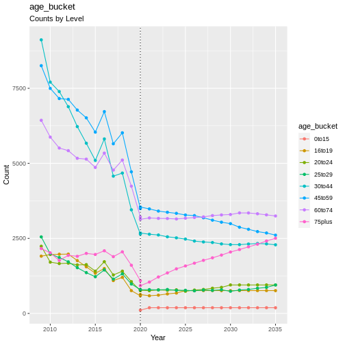

Ageing
------

Ageing is an obvious process and doesn’t really warrant any
documentation, but I thought this could also be a good place to put some
information relating to the age structure of the population as well as
some information on how child ages are updated in the module. (For the
record, the age of each individual is incremented by 1 with each wave of
simulation).

.. code:: r

   handover_ordinal(raw.dat, base.dat, var = 'age_bucket')

   plot of chunk age_structure

Child Ages
~~~~~~~~~~

Something else that happens in the ageing module is that child ages are
also incremented. Child ages are held in a single string column in the
interest of reducing the data size. For example, a ``child_ages`` value
of ``2_4_7`` indicates a household with 3 children aged 2, 4, and 7. The
function ``Ageing.update_child_ages()`` increments ages in these strings
each time step.

.. code:: r

   child_ages_lineplot(raw.dat, base.dat)

::

   ## Error in `summarise()`:
   ## ℹ In argument: `child_ages = find_mode(child_ages)`.
   ## ℹ In group 1: `time = 2014`, `hidp = 68088410`.
   ## Caused by error in `find_mode()`:
   ## ! could not find function "find_mode"

References
~~~~~~~~~~
