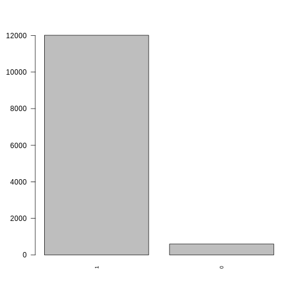
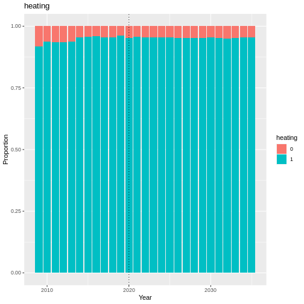
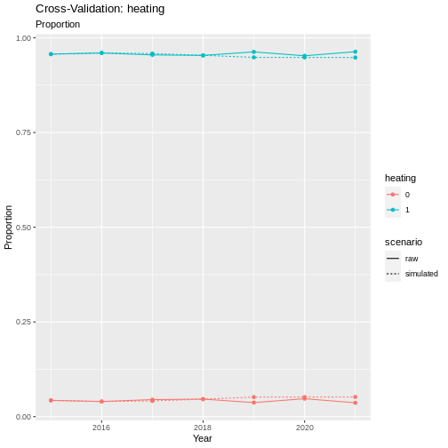
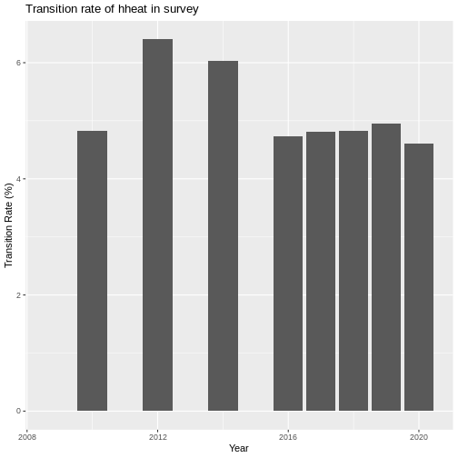
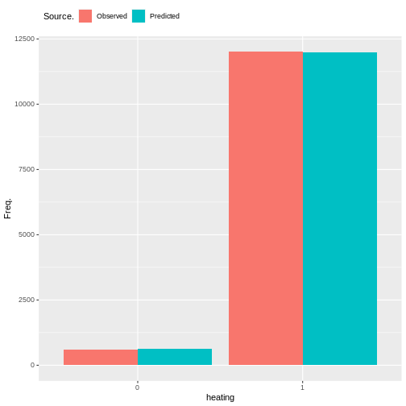
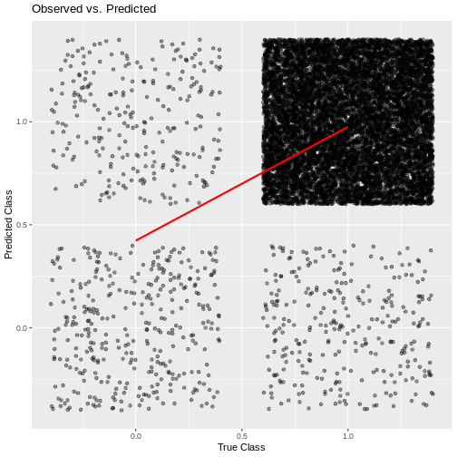

Heating
-------

The Heating module is not present in all experiments. It has been
included in the SF-12 and housing experiments, but is not technically
required for SF-12 simulation runs.

Heating is a binary variable that represents an individuals ability to
adequately heat their home. The variable is taken directly from the
survey, from the
```hheat`` <https://www.understandingsociety.ac.uk/documentation/mainstage/variables/hheat/>`__
variable.

*NOTE:* Heating is not present in every wave of the survey. This was
problematic in the generation of the housing_quality composite variable.
For this reason, we decided to forward fill this variable to fill in
some values for the missing waves. Justification for this decision is in
the section `Justification for Forward
Fill <#Justification-for-Forward-Fill>`__.



   plot of chunk heating_barchart

Transition Model
~~~~~~~~~~~~~~~~

To estimate transitions in heating, we fit a logit model using the
``glm()`` function from the stats package in R. We used the binomial
family with a logit link function.

Formula:

.. math::   heating \sim heating\_last + age + sex + ethnicity + region + education\_state + housing\_quality + neighbourhood\_safety\\ + loneliness + nutrition\_quality + ncigs + hh\_income + SF\_12 + financial\_situation + behind\_on\_bills  

========= =========== ========================
Predictor Description Literature/Justification
========= =========== ========================
\                     
\                     
\                     
\                     
========= =========== ========================

.. code:: r

   summary(model)

::

   ## 
   ## Call:
   ## glm(formula = formula, family = binomial(link = "logit"), data = data, 
   ##     weights = weight)
   ## 
   ## Deviance Residuals: 
   ##      Min        1Q    Median        3Q       Max  
   ## -1.33703   0.01769   0.02867   0.04594   0.85367  
   ## 
   ## Coefficients:
   ##                                               Estimate Std. Error z value
   ## (Intercept)                                   2.950340   3.704914   0.796
   ## factor(heating)1                              3.319767   1.458905   2.276
   ## scale(age)                                   -0.068202   0.319234  -0.214
   ## factor(sex)Male                               0.096644   0.582296   0.166
   ## relevel(factor(ethnicity), ref = "WBI")BAN   -0.244995   2.466160  -0.099
   ## relevel(factor(ethnicity), ref = "WBI")BLA    0.297122   1.786083   0.166
   ## relevel(factor(ethnicity), ref = "WBI")BLC   -0.228502   2.063753  -0.111
   ## relevel(factor(ethnicity), ref = "WBI")CHI   -0.160526   3.444261  -0.047
   ## relevel(factor(ethnicity), ref = "WBI")IND   -0.035215   1.568074  -0.022
   ## relevel(factor(ethnicity), ref = "WBI")MIX    0.277764   1.877503   0.148
   ## relevel(factor(ethnicity), ref = "WBI")OAS    1.348962   3.029686   0.445
   ## relevel(factor(ethnicity), ref = "WBI")OBL   -0.848160   5.935335  -0.143
   ## relevel(factor(ethnicity), ref = "WBI")OTH    2.894664   4.779247   0.606
   ## relevel(factor(ethnicity), ref = "WBI")PAK   -0.556564   1.513136  -0.368
   ## relevel(factor(ethnicity), ref = "WBI")WHO   -0.179361   1.179221  -0.152
   ## factor(region)East of England                 1.317506   1.690274   0.779
   ## factor(region)London                         -0.814064   1.176274  -0.692
   ## factor(region)North East                      1.244462   2.184858   0.570
   ## factor(region)North West                     -0.169440   1.237976  -0.137
   ## factor(region)Northern Ireland               -0.475106   2.250174  -0.211
   ## factor(region)Scotland                        0.156604   1.576786   0.099
   ## factor(region)South East                     -0.185219   1.183122  -0.157
   ## factor(region)South West                      0.244589   1.406359   0.174
   ## factor(region)Wales                           0.751346   1.878305   0.400
   ## factor(region)West Midlands                   0.761370   1.439835   0.529
   ## factor(region)Yorkshire and The Humber        0.080737   1.326698   0.061
   ## relevel(factor(education_state), ref = "1")0 -1.335485   3.217566  -0.415
   ## relevel(factor(education_state), ref = "1")2 -1.521265   3.199262  -0.476
   ## relevel(factor(education_state), ref = "1")3 -0.892079   3.279710  -0.272
   ## relevel(factor(education_state), ref = "1")5 -1.660019   3.251868  -0.510
   ## relevel(factor(education_state), ref = "1")6 -1.455852   3.206597  -0.454
   ## relevel(factor(education_state), ref = "1")7 -0.714272   3.323053  -0.215
   ## factor(housing_quality)Low                   -0.358152   1.505364  -0.238
   ## factor(housing_quality)Medium                -0.543219   0.798922  -0.680
   ## factor(loneliness)2                           0.001498   0.674986   0.002
   ## factor(loneliness)3                           0.061320   1.041214   0.059
   ## scale(nutrition_quality)                      0.021469   0.299282   0.072
   ## scale(ncigs)                                 -0.016210   0.236582  -0.069
   ## scale(hh_income)                              0.354331   0.450281   0.787
   ## scale(SF_12)                                  0.194311   0.306314   0.634
   ## factor(financial_situation)2                 -0.410978   0.997972  -0.412
   ## factor(financial_situation)3                 -1.077603   1.028242  -1.048
   ## factor(financial_situation)4                 -1.816079   1.188545  -1.528
   ## factor(financial_situation)5                 -1.530868   1.592330  -0.961
   ## factor(behind_on_bills)2                     -0.837083   0.797210  -1.050
   ## factor(behind_on_bills)3                     -0.263824   2.678453  -0.098
   ##                                              Pr(>|z|)  
   ## (Intercept)                                    0.4258  
   ## factor(heating)1                               0.0229 *
   ## scale(age)                                     0.8308  
   ## factor(sex)Male                                0.8682  
   ## relevel(factor(ethnicity), ref = "WBI")BAN     0.9209  
   ## relevel(factor(ethnicity), ref = "WBI")BLA     0.8679  
   ## relevel(factor(ethnicity), ref = "WBI")BLC     0.9118  
   ## relevel(factor(ethnicity), ref = "WBI")CHI     0.9628  
   ## relevel(factor(ethnicity), ref = "WBI")IND     0.9821  
   ## relevel(factor(ethnicity), ref = "WBI")MIX     0.8824  
   ## relevel(factor(ethnicity), ref = "WBI")OAS     0.6561  
   ## relevel(factor(ethnicity), ref = "WBI")OBL     0.8864  
   ## relevel(factor(ethnicity), ref = "WBI")OTH     0.5447  
   ## relevel(factor(ethnicity), ref = "WBI")PAK     0.7130  
   ## relevel(factor(ethnicity), ref = "WBI")WHO     0.8791  
   ## factor(region)East of England                  0.4357  
   ## factor(region)London                           0.4889  
   ## factor(region)North East                       0.5690  
   ## factor(region)North West                       0.8911  
   ## factor(region)Northern Ireland                 0.8328  
   ## factor(region)Scotland                         0.9209  
   ## factor(region)South East                       0.8756  
   ## factor(region)South West                       0.8619  
   ## factor(region)Wales                            0.6891  
   ## factor(region)West Midlands                    0.5970  
   ## factor(region)Yorkshire and The Humber         0.9515  
   ## relevel(factor(education_state), ref = "1")0   0.6781  
   ## relevel(factor(education_state), ref = "1")2   0.6344  
   ## relevel(factor(education_state), ref = "1")3   0.7856  
   ## relevel(factor(education_state), ref = "1")5   0.6097  
   ## relevel(factor(education_state), ref = "1")6   0.6498  
   ## relevel(factor(education_state), ref = "1")7   0.8298  
   ## factor(housing_quality)Low                     0.8119  
   ## factor(housing_quality)Medium                  0.4965  
   ## factor(loneliness)2                            0.9982  
   ## factor(loneliness)3                            0.9530  
   ## scale(nutrition_quality)                       0.9428  
   ## scale(ncigs)                                   0.9454  
   ## scale(hh_income)                               0.4313  
   ## scale(SF_12)                                   0.5259  
   ## factor(financial_situation)2                   0.6805  
   ## factor(financial_situation)3                   0.2946  
   ## factor(financial_situation)4                   0.1265  
   ## factor(financial_situation)5                   0.3364  
   ## factor(behind_on_bills)2                       0.2937  
   ## factor(behind_on_bills)3                       0.9215  
   ## ---
   ## Signif. codes:  0 '***' 0.001 '**' 0.01 '*' 0.05 '.' 0.1 ' ' 1
   ## 
   ## (Dispersion parameter for binomial family taken to be 1)
   ## 
   ##     Null deviance: 166.66  on 9324  degrees of freedom
   ## Residual deviance: 106.76  on 9279  degrees of freedom
   ##   (1 observation deleted due to missingness)
   ## AIC: 94.42
   ## 
   ## Number of Fisher Scoring iterations: 8

Validation
~~~~~~~~~~

.. code:: r

   handover_ordinal(raw.dat, base.dat, v)



   plot of chunk heating_validation

.. code:: r

   pivoted <- combine_and_pivot_long(df1 = cv,
                                      df1.name = 'simulated',
                                      df2 = raw,
                                      df2.name = 'raw',
                                      var = 'heating')

   cv_ordinal_plots(pivoted.df = pivoted,
                    var = 'heating',
                    save = FALSE)

::

   ## `summarise()` has grouped output by 'time', 'scenario'. You can override using
   ## the `.groups` argument.



   plot of chunk heating_cv

Justification for Forward Fill
~~~~~~~~~~~~~~~~~~~~~~~~~~~~~~

Adequate heating in the household is a key component of the
housing_quality proxy variable. It is one of the core variables of
housing_quality, and the one that is most closely associated with
conditions of poor housing quality such as excessive damp and mould.
However, unfortunately the ``hheat`` variable in Understanding Society
(the source of the heating variable) is not present in every wave. This
is problematic for the generation of the housing_quality proxy variable,
so here I will provide some justification that this is not a terrible
idea. The table below shows which waves ``hheat`` is present in
Understanding Society.

| Wave \| Present? \|
| 1 \| TRUE \|
| 2 \| TRUE \|
| 3 \| FALSE \|
| 4 \| TRUE \|
| 5 \| FALSE \|
| 6 \| TRUE \|
| 7 \| FALSE \|
| 8 \| TRUE \|
| 9 \| TRUE \|
| 10 \| TRUE \|
| 11 \| TRUE \|
| 12 \| TRUE \|
| 13 \| FALSE \|
| 14 \| TRUE \|

First we will look at how static the heating variable is over time. We
are looking at the proportion of the sample at each wave that shows a
change in ``hheat``.

.. code:: r

   year_list <- c(2009, 2010, 2012, 2014, 2016, 2017, 2018, 2019, 2020, 2022)
   transition_summary <- get_transition_rate(v, year_list)

   ggplot(transition_summary, aes(x = time, y = transition_rate)) +
     geom_col() +
     labs(title = "Transition rate of hheat in survey") +
     xlab('Year') +
     ylab('Transition Rate (%)')



   plot of chunk ffill_justification

Results
~~~~~~~

Random Forest Ordinal models from the ranger package cannot provide a
summary like some other models can, so instead we will look at plots of
observed vs predicted values as well as the importance of each variable
in the resulting model.



   plot of chunk heating_output

.. code:: r

   cumulative_link_plot(obs, preds)

::

   ## `geom_smooth()` using formula = 'y ~ x'



   plot of chunk heating_performance

References
~~~~~~~~~~
