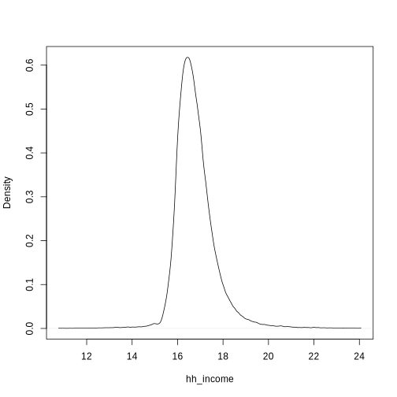
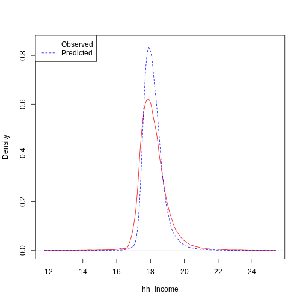
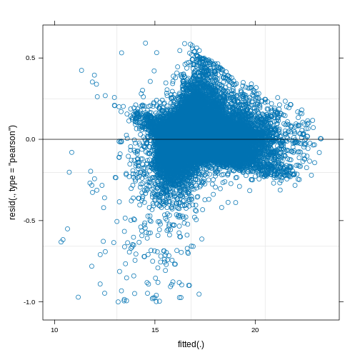

Household Disposable Income
---------------------------

Household disposable income is a well known indicator of mental
well-being (Graham 2009). Estimating this is a crucial instrument for
the effects of many policy interventions

The output variable is monthly household disposable income. This is
calculated as a composite using several variables. Rent, mortgages, and
council tax are subtracted from net household income and adjusted by
household size. This value is then adjusted for yearly inflation
estimates.

.. math::     hh\_income\_intermediate = ((net\_hh\_income) - (rent + mortgage + council\_tax)) / oecd\_equivalence\_factor

.. math::     hh\_income = hh\_income\_intermediate * inflation\_factor

More information on these variables can be found at the following links:

-  `net_monthly_income <https://www.understandingsociety.ac.uk/documentation/mainstage/dataset-documentation/variable/fihhmnnet1_dv>`__
-  monthly_outgoings is the sum of
   `rent <https://www.understandingsociety.ac.uk/documentation/mainstage/dataset-documentation/variable/rentgrs_dv>`__,
   `mortgage <https://www.understandingsociety.ac.uk/documentation/mainstage/dataset-documentation/variable/xpmg_dv>`__,
   and `council
   tax <https://www.understandingsociety.ac.uk/documentation/mainstage/variables/ctband_dv/>`__.
-  `oecd_equivalence_scale <https://www.understandingsociety.ac.uk/documentation/mainstage/dataset-documentation/variable/ieqmoecd_dv>`__
-  See note `below <#Council-Tax>`__ about council tax.

This produces a continuous distribution of pounds per month available
for a household to spend as it likes. This is plotted below with a
median income of :math:`\sim£1650`.

.. code:: r

   continuous_density(obs)

   plot of chunk hh_income_data

Transition Model
~~~~~~~~~~~~~~~~

To estimate this variable we use a Generalised Linear Mixed Model (GLMM)
using the
`lme4 <https://www.rdocumentation.org/packages/lme4/versions/1.1-36>`__
package in R.

Formula:

.. math::   hh\_income\_next \sim hh\_income\_last + age + age^2 +  age^3 + sex + ethnicity + region + education\_state + job\_sec + SF\_12 + labour\_state + (1\|pidp)

Each variable included is defined as follows. Each variable with
discrete values is defined in the data tables section of this
documentation
`here <https://leeds-mrg.github.io/Minos/documentation/data_tables.html>`__.

-  sex. Individual’s biological sex. (Dilmaghani 2018)
-  age. Age at time of interview.
-  ethnicity. Individual ethnicity. Discrete string values White
   British, Black African, etc. (Clemens and Dibben 2014)
-  region. Administrative region of the UK. Discrete strings such as
   London, North-East. (Brewer et al. 2007)
-  household income. Previous household income values are a strong
   indicator of current value. (Dilmaghani 2018)
-  job_sec. NSSEC code for individual’s employment. Ordinal values
   describing job quality. (Clemens and Dibben 2014)
-  labour state. Is a person employed, unemployed, student etc. Discrete
   states. (Dilmaghani 2018)
-  education state. Highest attained qualification. Ordinal values based
   on UK government education tiers (Eika, Mogstad, and Zafar 2019)
-  SF_12. Mental well-being. Continuous score indicating overall
   mental-wellbeing. (Viswanathan, Anderson, and Thomas 2005)

Council Tax
^^^^^^^^^^^

In the UKHLS main release data, `council
tax <https://www.understandingsociety.ac.uk/documentation/mainstage/variables/ctband_dv/>`__
information is reported by band. Specific amount deductions are only
available in the Special Licence and Secure Access datasets. Instead of
reported deductions, we have simulated the amount of council tax each
household is paying by taking a random uniform draw for each household
within the confines of their band.

Results
~~~~~~~

Model coefficients and diagnostics are displayed below. To summarise:

-  r squared of 0.21 indicates reasonable fit.
-  Gender not significant. Some ethnicities see increases. Only London
   has higher income. High quality jobs earn more. PT employed earn less
   students earn more. Housing quality strong indicator of higher
   income.
-  diagnostic plots show under dispersion. Some extreme outlier values
   need investigating.
-  overall decent fit.

   plot of chunk income_output

::

   ## Generalized linear mixed model fit by maximum likelihood (Adaptive Gauss-Hermite Quadrature, nAGQ = 0) ['glmerMod']
   ##  Family: Gamma  ( log )
   ## Formula: hh_income_new ~ scale(hh_income) + scale(age) + I(scale(age)^2) +  
   ##     I(scale(age)^3) + factor(sex) + relevel(factor(ethnicity),  
   ##     ref = "WBI") + factor(region) + relevel(factor(education_state),  
   ##     ref = "1") + relevel(factor(job_sec), ref = "3") + scale(SF_12) +  
   ##     relevel(factor(S7_labour_state), ref = "FT Employed") + (1 |      pidp)
   ##    Data: data
   ## 
   ##       AIC       BIC    logLik  deviance  df.resid 
   ##  661185.7  661698.7 -330543.8  661087.7    260689 
   ## 
   ## Scaled residuals: 
   ##      Min       1Q   Median       3Q      Max 
   ## -23.4771  -0.3230  -0.0373   0.2904  13.4186 
   ## 
   ## Random effects:
   ##  Groups   Name        Variance  Std.Dev.
   ##  pidp     (Intercept) 0.0004406 0.02099 
   ##  Residual             0.0018141 0.04259 
   ## Number of obs: 260738, groups:  pidp, 49574
   ## 
   ## Fixed effects:
   ##                                                                     Estimate Std. Error  t value Pr(>|z|)    
   ## (Intercept)                                                        2.8528125  0.0010844 2630.731  < 2e-16 ***
   ## scale(hh_income)                                                   0.0174066  0.0001115  156.058  < 2e-16 ***
   ## scale(age)                                                         0.0124067  0.0003114   39.844  < 2e-16 ***
   ## I(scale(age)^2)                                                    0.0017666  0.0001579   11.185  < 2e-16 ***
   ## I(scale(age)^3)                                                   -0.0033824  0.0001177  -28.744  < 2e-16 ***
   ## factor(sex)Male                                                    0.0002615  0.0002838    0.922 0.356778    
   ## relevel(factor(ethnicity), ref = "WBI")BAN                        -0.0141264  0.0010797  -13.084  < 2e-16 ***
   ## relevel(factor(ethnicity), ref = "WBI")BLA                        -0.0176405  0.0009463  -18.642  < 2e-16 ***
   ## relevel(factor(ethnicity), ref = "WBI")BLC                        -0.0135090  0.0009933  -13.600  < 2e-16 ***
   ## relevel(factor(ethnicity), ref = "WBI")CHI                        -0.0038870  0.0019705   -1.973 0.048537 *  
   ## relevel(factor(ethnicity), ref = "WBI")IND                        -0.0050112  0.0007228   -6.933 4.13e-12 ***
   ## relevel(factor(ethnicity), ref = "WBI")MIX                        -0.0070659  0.0009812   -7.202 5.96e-13 ***
   ## relevel(factor(ethnicity), ref = "WBI")OAS                        -0.0124415  0.0011285  -11.025  < 2e-16 ***
   ## relevel(factor(ethnicity), ref = "WBI")OBL                        -0.0110606  0.0032670   -3.386 0.000710 ***
   ## relevel(factor(ethnicity), ref = "WBI")OTH                        -0.0106280  0.0021379   -4.971 6.65e-07 ***
   ## relevel(factor(ethnicity), ref = "WBI")PAK                        -0.0126053  0.0007954  -15.847  < 2e-16 ***
   ## relevel(factor(ethnicity), ref = "WBI")WHO                        -0.0036137  0.0007732   -4.674 2.96e-06 ***
   ## factor(region)East of England                                      0.0018727  0.0006288    2.978 0.002897 ** 
   ## factor(region)London                                               0.0044200  0.0006249    7.073 1.51e-12 ***
   ## factor(region)North East                                          -0.0029570  0.0008010   -3.692 0.000223 ***
   ## factor(region)North West                                           0.0007813  0.0006082    1.285 0.198915    
   ## factor(region)Scotland                                             0.0025668  0.0006631    3.871 0.000108 ***
   ## factor(region)South East                                           0.0039772  0.0005859    6.788 1.13e-11 ***
   ## factor(region)South West                                           0.0001093  0.0006382    0.171 0.864044    
   ## factor(region)Wales                                               -0.0002781  0.0007182   -0.387 0.698568    
   ## factor(region)West Midlands                                        0.0018035  0.0006350    2.840 0.004510 ** 
   ## factor(region)Yorkshire and The Humber                            -0.0007301  0.0006380   -1.144 0.252431    
   ## relevel(factor(education_state), ref = "1")0                      -0.0021720  0.0009517   -2.282 0.022476 *  
   ## relevel(factor(education_state), ref = "1")2                       0.0037217  0.0009600    3.877 0.000106 ***
   ## relevel(factor(education_state), ref = "1")3                       0.0075999  0.0009991    7.606 2.82e-14 ***
   ## relevel(factor(education_state), ref = "1")5                       0.0081584  0.0010215    7.986 1.39e-15 ***
   ## relevel(factor(education_state), ref = "1")6                       0.0154672  0.0009814   15.760  < 2e-16 ***
   ## relevel(factor(education_state), ref = "1")7                       0.0190694  0.0010134   18.818  < 2e-16 ***
   ## relevel(factor(job_sec), ref = "3")0                              -0.0078144  0.0006533  -11.962  < 2e-16 ***
   ## relevel(factor(job_sec), ref = "3")1                               0.0075922  0.0006926   10.962  < 2e-16 ***
   ## relevel(factor(job_sec), ref = "3")2                               0.0069332  0.0005711   12.141  < 2e-16 ***
   ## relevel(factor(job_sec), ref = "3")4                              -0.0035186  0.0004567   -7.704 1.32e-14 ***
   ## relevel(factor(job_sec), ref = "3")5                              -0.0083791  0.0005588  -14.995  < 2e-16 ***
   ## relevel(factor(job_sec), ref = "3")6                              -0.0043924  0.0005980   -7.345 2.05e-13 ***
   ## relevel(factor(job_sec), ref = "3")7                              -0.0069727  0.0004469  -15.603  < 2e-16 ***
   ## relevel(factor(job_sec), ref = "3")8                              -0.0077602  0.0005616  -13.817  < 2e-16 ***
   ## scale(SF_12)                                                       0.0014764  0.0001070   13.796  < 2e-16 ***
   ## relevel(factor(S7_labour_state), ref = "FT Employed")Family Care  -0.0070920  0.0007663   -9.255  < 2e-16 ***
   ## relevel(factor(S7_labour_state), ref = "FT Employed")FT Education -0.0043886  0.0007030   -6.243 4.30e-10 ***
   ## relevel(factor(S7_labour_state), ref = "FT Employed")Job Seeking  -0.0059763  0.0007395   -8.081 6.42e-16 ***
   ## relevel(factor(S7_labour_state), ref = "FT Employed")Not Working  -0.0062818  0.0006408   -9.804  < 2e-16 ***
   ## relevel(factor(S7_labour_state), ref = "FT Employed")PT Employed  -0.0037173  0.0003325  -11.179  < 2e-16 ***
   ## ---
   ## Signif. codes:  0 '***' 0.001 '**' 0.01 '*' 0.05 '.' 0.1 ' ' 1

::

   ## 
   ## Correlation matrix not shown by default, as p = 47 > 12.
   ## Use print(summary(model), correlation=TRUE)  or
   ##     vcov(summary(model))        if you need it

   plot of chunk income_output

References
~~~~~~~~~~

.. container:: references csl-bib-body hanging-indent
   :name: refs

   .. container:: csl-entry
      :name: ref-brewer2007poverty

      Brewer, Mike, Alastair Muriel, David Phillips, and Luke Sibieta.
      2007. “Poverty and Inequality in the UK: 2008.”

   .. container:: csl-entry
      :name: ref-clemens2014method

      Clemens, Tom, and Chris Dibben. 2014. “A Method for Estimating
      Wage, Using Standardised Occupational Classifications, for Use in
      Medical Research in the Place of Self-Reported Income.” *BMC
      Medical Research Methodology* 14 (1): 1–8.

   .. container:: csl-entry
      :name: ref-dilmaghani2018sexual

      Dilmaghani, Maryam. 2018. “Sexual Orientation, Labour Earnings,
      and Household Income in Canada.” *Journal of Labor Research* 39
      (1): 41–55.

   .. container:: csl-entry
      :name: ref-eika2019educational

      Eika, Lasse, Magne Mogstad, and Basit Zafar. 2019. “Educational
      Assortative Mating and Household Income Inequality.” *Journal of
      Political Economy* 127 (6): 2795–835.

   .. container:: csl-entry
      :name: ref-graham2009understanding

      Graham, Hilary. 2009. *Understanding Health Inequalities*.
      McGraw-hill education (UK).

   .. container:: csl-entry
      :name: ref-viswanathan2005nature

      Viswanathan, Hema, Rodney Anderson, and Joseph Thomas. 2005.
      “Nature and Correlates of SF-12 Physical and Mental Quality of
      Life Components Among Low-Income HIV Adults Using an HIV Service
      Center.” *Quality of Life Research* 14 (4): 935–44.
