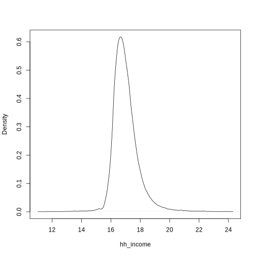
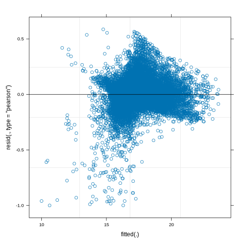

================
Household Income
================

Household Income
================

Household disposable income is a well known indicator of mental
well-being (Graham 2009). Estimating this is a crucial instrument for
the effects of many policy interventions

The output variable is monthly household disposable income. This is
calculated as a composite using several variables. Rent, mortgages, and
council tax are subtracted from net household income and adjusted by
household size. This value is then adjusted for yearly inflation
estimates.

.. math::     hh\_income\_intermediate = ((net\_hh\_income) - (rent + mortgage + council\_tax)) / hh\_size

.. math::     hh\_income = hh\_income\_ * inflation\_factor

This produces a continuous distribution of pounds per month available
for a household to spend as it likes. This is plotted below with a
median income of :math:`~£1250`.

.. code:: r

   continuous_density("hh_income")  

   plot of chunk hh_income_data

Methods
-------

To estimate this variable Ordinary Least Squares (OLS) linear regression
is used. This is a common technique for estimating Gaussian distributed
variables that is easy to implement using base R.

Data
----

The formula for this linear regression is given as

.. math:: hh\_income\_next ~ age + sex + factor(ethnicity) + factor(region) + scale(hh\_income) + factor(job\_sec) + factor(labour\_state) + factor(education\_state) + scale(SF\_12) + factor(housing\_quality)

Each variable included is defined as follows. Each variable with
discrete values is defined in the data tables section of this
documentation
`here <https://leeds-mrg.github.io/Minos/documentation/data_tables.html>`__.

-  sex. Individual’s biological sex. (Dilmaghani 2018)
-  ethnicity. Individual ethnicity. Discrete string values White
   British, Black African, etc. (Clemens and Dibben 2014)
-  region. Administrative region of the UK. Discrete strings such as
   London, North-East. (Brewer et al. 2007)
-  household income. Previous household income values are a strong
   indicator of current value. (Dilmaghani 2018)
-  job_sec. NSSEC code for individual’s employment. Ordinal values
   describing job quality. (Clemens and Dibben 2014)
-  labour state. Is a person employed, unemployed, student etc. Discrete
   states. (Dilmaghani 2018)
-  education state. Highest attain qualification. Ordinal values based
   on UK government education tiers (Eika, Mogstad, and Zafar 2019)
-  SF_12. Mental well-being. Continuous score indicating overall
   mental-wellbeing. is this an indicator of hh_income? (Viswanathan,
   Anderson, and Thomas 2005)
-  housing quality. Ordinal values indicating number of appliances in
   household. (Brewer et al. 2007)

Results
-------

Model coefficients and diagnostics are displayed below. To summarise - r
squared of 0.21 indicates reasonable fit. - Gender not significant. Some
ethnicities see increases. Only London has higher income. High quality
jobs eanr more. PT employed earn less students earn more. Housing
quality strong indicator of higher income. - diagnostic plots show
underdispersion. Some extreme outlier values need investigating. -
overall decent fit.

::

   ## 
   ## Call:
   ## lm(formula = formula, data = data, weights = weight)
   ## 
   ## Weighted Residuals:
   ##      Min       1Q   Median       3Q      Max 
   ## -1990922   -13848        0     7539  3403183 
   ## 
   ## Coefficients:
   ##                                        Estimate Std. Error t value Pr(>|t|)    
   ## (Intercept)                             412.218    194.042   2.124  0.03365 *  
   ## age                                       6.291      1.038   6.060 1.39e-09 ***
   ## sexMale                                  12.256     24.496   0.500  0.61684    
   ## factor(ethnicity)BLA                    120.620    180.062   0.670  0.50294    
   ## factor(ethnicity)BLC                    361.686    202.933   1.782  0.07472 .  
   ## factor(ethnicity)CHI                    644.037    237.557   2.711  0.00671 ** 
   ## factor(ethnicity)IND                    268.561    168.894   1.590  0.11183    
   ## factor(ethnicity)MIX                    457.606    178.013   2.571  0.01016 *  
   ## factor(ethnicity)OAS                     61.325    184.060   0.333  0.73900    
   ## factor(ethnicity)OBL                     -5.696    458.270  -0.012  0.99008    
   ## factor(ethnicity)OTH                    262.356    241.228   1.088  0.27679    
   ## factor(ethnicity)PAK                    183.294    179.340   1.022  0.30677    
   ## factor(ethnicity)WBI                    391.118    154.627   2.529  0.01143 *  
   ## factor(ethnicity)WHO                    331.423    160.909   2.060  0.03944 *  
   ## factor(region)East of England            56.558     54.238   1.043  0.29707    
   ## factor(region)London                    246.671     53.777   4.587 4.53e-06 ***
   ## factor(region)North East                -30.897     67.059  -0.461  0.64499    
   ## factor(region)North West                 66.540     53.963   1.233  0.21757    
   ## factor(region)Northern Ireland           38.943     82.628   0.471  0.63743    
   ## factor(region)Scotland                   65.676     61.669   1.065  0.28690    
   ## factor(region)South East                 45.458     51.130   0.889  0.37398    
   ## factor(region)South West                 29.053     55.642   0.522  0.60157    
   ## factor(region)Wales                      35.705     75.613   0.472  0.63679    
   ## factor(region)West Midlands              76.644     56.114   1.366  0.17201    
   ## factor(region)Yorkshire and The Humber  110.450     56.170   1.966  0.04927 *  
   ## scale(hh_income)                        581.992     11.532  50.468  < 2e-16 ***
   ## factor(job_sec)1                        490.629     95.806   5.121 3.07e-07 ***
   ## factor(job_sec)2                        389.665     82.418   4.728 2.29e-06 ***
   ## factor(job_sec)3                        301.704     70.303   4.291 1.79e-05 ***
   ## factor(job_sec)4                        101.444     75.271   1.348  0.17777    
   ## factor(job_sec)5                        -67.170     92.209  -0.728  0.46635    
   ## factor(job_sec)6                        179.737     85.909   2.092  0.03644 *  
   ## factor(job_sec)7                         85.658     70.806   1.210  0.22639    
   ## factor(job_sec)8                         25.167     79.558   0.316  0.75175    
   ## factor(labour_state)Family Care          26.084     92.053   0.283  0.77691    
   ## factor(labour_state)Maternity Leave      -1.985    142.958  -0.014  0.98892    
   ## factor(labour_state)PT Employed        -110.989     42.599  -2.605  0.00918 ** 
   ## factor(labour_state)Retired              44.437     76.883   0.578  0.56328    
   ## factor(labour_state)Self-employed       115.570     65.302   1.770  0.07679 .  
   ## factor(labour_state)Sick/Disabled       -28.306     89.746  -0.315  0.75246    
   ## factor(labour_state)Student             198.869     72.423   2.746  0.00604 ** 
   ## factor(labour_state)Unemployed          -51.936     88.115  -0.589  0.55559    
   ## factor(education_state)1                -89.767     91.701  -0.979  0.32764    
   ## factor(education_state)2                155.249     33.662   4.612 4.02e-06 ***
   ## factor(education_state)3                228.772     43.900   5.211 1.90e-07 ***
   ## factor(education_state)5                137.234     47.630   2.881  0.00397 ** 
   ## factor(education_state)6                265.992     37.982   7.003 2.60e-12 ***
   ## factor(education_state)7                416.316     44.055   9.450  < 2e-16 ***
   ## scale(SF_12)                             29.686     15.563   1.907  0.05648 .  
   ## factor(housing_quality)2                159.469     76.339   2.089  0.03673 *  
   ## factor(housing_quality)3                423.238     78.000   5.426 5.84e-08 ***
   ## ---
   ## Signif. codes:  0 '***' 0.001 '**' 0.01 '*' 0.05 '.' 0.1 ' ' 1
   ## 
   ## Residual standard error: 76540 on 16036 degrees of freedom
   ##   (255 observations deleted due to missingness)
   ## Multiple R-squared:  0.2143, Adjusted R-squared:  0.2119 
   ## F-statistic: 87.49 on 50 and 16036 DF,  p-value: < 2.2e-16

|plot of chunk income_output|\ |image1|\ |image2|\ |image3|\ |image4|

References
----------

.. container:: references csl-bib-body hanging-indent
   :name: refs

   .. container:: csl-entry
      :name: ref-brewer2007poverty

      Brewer, Mike, Alastair Muriel, David Phillips, and Luke Sibieta.
      2007. “Poverty and Inequality in the UK: 2008.”

   .. container:: csl-entry
      :name: ref-clemens2014method

      Clemens, Tom, and Chris Dibben. 2014. “A Method for Estimating
      Wage, Using Standardised Occupational Classifications, for Use in
      Medical Research in the Place of Self-Reported Income.” *BMC
      Medical Research Methodology* 14 (1): 1–8.

   .. container:: csl-entry
      :name: ref-dilmaghani2018sexual

      Dilmaghani, Maryam. 2018. “Sexual Orientation, Labour Earnings,
      and Household Income in Canada.” *Journal of Labor Research* 39
      (1): 41–55.

   .. container:: csl-entry
      :name: ref-eika2019educational

      Eika, Lasse, Magne Mogstad, and Basit Zafar. 2019. “Educational
      Assortative Mating and Household Income Inequality.” *Journal of
      Political Economy* 127 (6): 2795–835.

   .. container:: csl-entry
      :name: ref-graham2009understanding

      Graham, Hilary. 2009. *Understanding Health Inequalities*.
      McGraw-hill education (UK).

   .. container:: csl-entry
      :name: ref-viswanathan2005nature

      Viswanathan, Hema, Rodney Anderson, and Joseph Thomas. 2005.
      “Nature and Correlates of SF-12 Physical and Mental Quality of
      Life Components Among Low-Income HIV Adults Using an HIV Service
      Center.” *Quality of Life Research* 14 (4): 935–44.

.. |plot of chunk income_output| image:: ./figure/income_output-1.png

.. |image2| image:: ./figure/income_output-3.png
.. |image3| image:: ./figure/income_output-4.png
.. |image4| image:: ./figure/income_output-5.png
