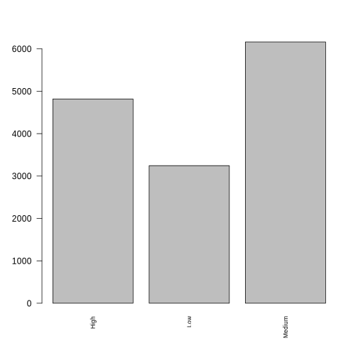
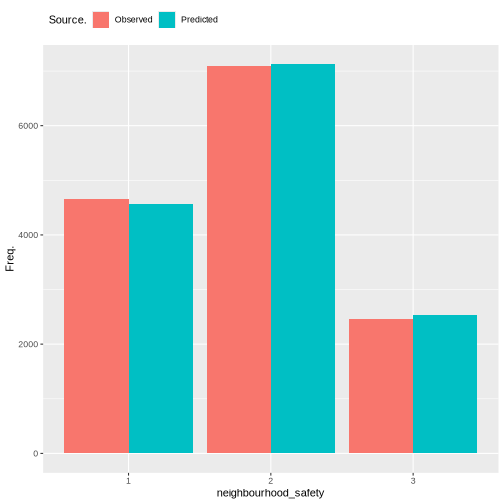

=======
Housing
=======

Housing Quality
===============

Number of cigarettes consumed is an indicator of XXXX. test reference
(Nelson 1987).

Methods
-------

What methods are used? Justification due to output data type.
explanation of model output.

   plot of chunk housing_barchart

Data
----

What variables are included? Why is this output chosen. What explanatory
variables are used and why are they chosen

Results
-------

What are the results. Coefficients tables. diagnostic plots. measures of
goodness of fit.

   plot of chunk housing_output

::

   ##                           Length Class         Mode     
   ## predictions               181122 -none-        numeric  
   ## num.trees                      1 -none-        numeric  
   ## num.independent.variables      1 -none-        numeric  
   ## mtry                           1 -none-        numeric  
   ## min.node.size                  1 -none-        numeric  
   ## prediction.error               1 -none-        numeric  
   ## forest                        11 ranger.forest list     
   ## splitrule                      1 -none-        character
   ## treetype                       1 -none-        character
   ## call                           6 -none-        call     
   ## importance.mode                1 -none-        character
   ## num.samples                    1 -none-        numeric  
   ## replace                        1 -none-        logical  
   ## dependent.variable.name        1 -none-        character

References
----------

.. container:: references csl-bib-body hanging-indent
   :name: refs

   .. container:: csl-entry
      :name: ref-1987:nelson

      Nelson, Edward. 1987. *Radically Elementary Probability Theory*.
      Princeton University Press.
