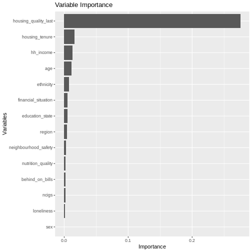

Housing Quality
---------------

Housing Quality is one of the pathways outlined by the SIPHER consortium
that mediates the impact of changes in household disposable income on
mental wellbeing. It is based on the presence of consumer durable items
in a household, as well as the ability to adequately heat the household.

Information on the variables involved:

-  fridge_freezer
   (`cduse5 <https://www.understandingsociety.ac.uk/documentation/mainstage/variables/cduse5/>`__)
-  washing_machine
   (`cduse6 <https://www.understandingsociety.ac.uk/documentation/mainstage/variables/cduse6/>`__)
-  tumble_dryer
   (`cduse7 <https://www.understandingsociety.ac.uk/documentation/mainstage/variables/cduse7/>`__)
-  dishwasher
   (`cduse8 <https://www.understandingsociety.ac.uk/documentation/mainstage/variables/cduse8/>`__)
-  microwave
   (`cduse9 <https://www.understandingsociety.ac.uk/documentation/mainstage/variables/cduse9/>`__)
-  heating
   (`hheat <https://www.understandingsociety.ac.uk/documentation/mainstage/variables/hheat/>`__)

The housing_quality composite variable is based on the presence of a set
of factors, separated into a core set and a bonus set. Variables in the
core set are access to a fridge freezer, a washing machine, and being
able to adequately heat your home. The bonus set includes access to a
dishwasher, microwave, and tumble dryer. We chose this distinction for 2
reasons; firstly the number of households without access to items in the
core set is much smaller than those without access to the bonus set, and
secondly because the bonus items can be considered more of a choice, and
do not necessarily represent lower housing quality if they are not
present. For example, some households will not have a microwave by
choice, which does not necessarily indicate poorer housing quality and
certainly not in the same way that having no access to a fridge freezer
would indicate lower quality. See table below for the core and bonus
groupings:

================ ============
Core             Bonus
================ ============
Fridge Freezer   Dishwasher
Washing Machines Tumble Dryer
Adequate Heating Microwave
================ ============

The housing_quality composite is defined as:

-  Missing 1+ core == 1
-  All core some bonus == 2
-  All core all bonus == 3

.. figure:: ./figure/housing_barchart-1.png
   :alt: plot of chunk housing_barchart

   plot of chunk housing_barchart

Transition Model
~~~~~~~~~~~~~~~~

We use a Random Forest Ordinal model from the
`ranger <https://www.rdocumentation.org/packages/ranger/versions/0.16.0>`__
package in R to estimate transitions for this variable.

Formula:

.. math::   housing\_quality \sim housing\_quality\_last + age + sex + ethnicity + region + education\_state + neighbourhood\_safety + loneliness + nutrition\_quality + ncigs + hh\_income + housing\_tenure + behind\_on\_bills + financial\_situation  

-  age: Age at time of interview.
-  sex: Individual’s biological sex.
-  ethnicity: Discrete string values White British, Black African, etc.
-  region: Administrative region of the UK. Discrete strings such as
   London, North-East.
-  education_state: Highest attained qualification. Ordinal values based
   on UK government education tiers
-  neighbourhood_safety: Ordinal values based on frequency of 6 factors
   related to safety
-  loneliness: Ordinal variable for frequency of feeling lonely.
   Often/Sometimes/Never
-  nutrition_quality: Household nutrition quality. Continuous variable
   proxied by frequency of consumption of fruit and vegetables.
-  ncigs: Tobacco consumption. Count of cigarettes smoked per week.
-  hh_income: Household Income. Continuous, equivalised household
   disposable income.
-  housing_tenure: Housing Tenure. Ordinal variable for tenure type
   e.g. Owned outright, Local authority rent
-  behind_on_bills: Subjective feeling of struggling to pay bills.
-  financial_situation: Ordinal variable for current subjective
   financial situation.
-  SF_12: Mental well-being. Continuous score indicating overall
   mental-wellbeing.

.. code:: r

   plot_rfo_importance(model)

   plot of chunk housing_model_summary

Results
~~~~~~~

Random Forest Ordinal models from the ranger package cannot provide a
summary like some other models can, so instead we will look at plots of
observed vs predicted values as well as the importance of each variable
in the resulting model.

.. figure:: ./figure/housing_output-1.png
   :alt: plot of chunk housing_output

   plot of chunk housing_output

References
~~~~~~~~~~
