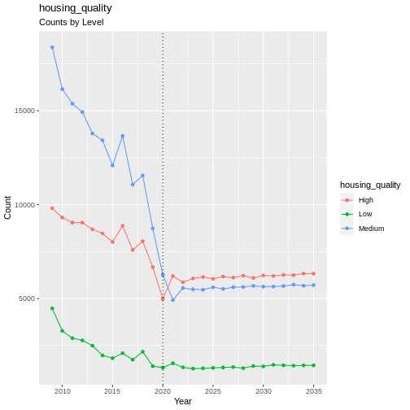
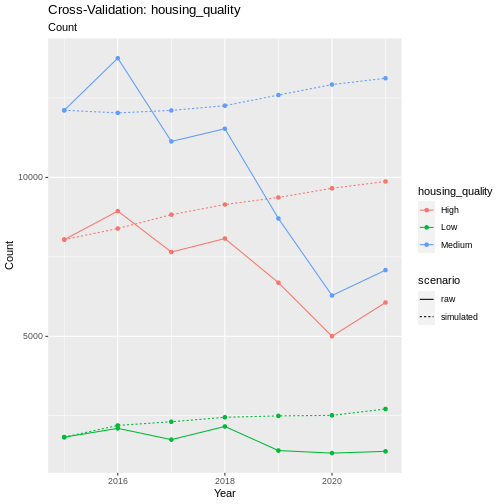
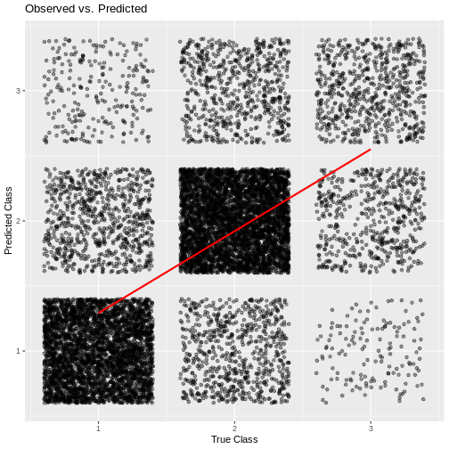

Housing Quality
---------------

Housing Quality is one of the pathways outlined by the SIPHER consortium
that mediates the impact of changes in household disposable income on
mental wellbeing. It is based on the presence of consumer durable items
in a household, as well as the ability to adequately heat the household.

Information on the variables involved:

-  fridge_freezer
   (`cduse5 <https://www.understandingsociety.ac.uk/documentation/mainstage/variables/cduse5/>`__)
-  washing_machine
   (`cduse6 <https://www.understandingsociety.ac.uk/documentation/mainstage/variables/cduse6/>`__)
-  tumble_dryer
   (`cduse7 <https://www.understandingsociety.ac.uk/documentation/mainstage/variables/cduse7/>`__)
-  dishwasher
   (`cduse8 <https://www.understandingsociety.ac.uk/documentation/mainstage/variables/cduse8/>`__)
-  microwave
   (`cduse9 <https://www.understandingsociety.ac.uk/documentation/mainstage/variables/cduse9/>`__)
-  heating
   (`hheat <https://www.understandingsociety.ac.uk/documentation/mainstage/variables/hheat/>`__)

The housing_quality composite variable is based on the presence of a set
of factors, separated into a core set and a bonus set. Variables in the
core set are access to a fridge freezer, a washing machine, and being
able to adequately heat your home. The bonus set includes access to a
dishwasher, microwave, and tumble dryer. We chose this distinction for 2
reasons; firstly the number of households without access to items in the
core set is much smaller than those without access to the bonus set, and
secondly because the bonus items can be considered more of a choice, and
do not necessarily represent lower housing quality if they are not
present. For example, some households will not have a microwave by
choice, which does not necessarily indicate poorer housing quality and
certainly not in the same way that having no access to a fridge freezer
would indicate lower quality. See table below for the core and bonus
groupings:

================ ============
Core             Bonus
================ ============
Fridge Freezer   Dishwasher
Washing Machines Tumble Dryer
Adequate Heating Microwave
================ ============

The housing_quality composite is defined as:

-  Missing 1+ core == 1
-  All core some bonus == 2
-  All core all bonus == 3

*IMPORTANT NOTE:* Unfortunately, one of the core components of this
composite is not present in every wave of the survey - ``heating``. This
caused us a major problem, as the way the pathways are devised we need
at least one wave with all pathway variables present, so we can fit a
transition model for SF-12. Because of this, we decided to forward fill
the ``heating`` variable before generating the ``housing_quality``
composite variable. As ``heating`` is a fairly static variable (highest
transition rate between years is 6%, mean 4.5%) we believe this is a
justified decision. Please see the heating module documentation page for
more information on this (specifically under the heading “Justification
for Forward Fill”.

.. figure:: ./figure/housing_barchart-1.png
   :alt: plot of chunk housing_barchart

   plot of chunk housing_barchart

Transition Model
~~~~~~~~~~~~~~~~

We use a Random Forest Ordinal model from the
`ranger <https://www.rdocumentation.org/packages/ranger/versions/0.16.0>`__
package in R to estimate transitions for this variable.

Formula:

.. math::   housing\_quality \sim housing\_quality\_last + age + sex + ethnicity + region + education\_state + \\neighbourhood\_safety + loneliness + nutrition\_quality + ncigs + hh\_income + \\housing\_tenure + behind\_on\_bills + financial\_situation + job\_sec  

+--------------------+------------------------+------------------------+
| Predictor          | Description            | Li                     |
|                    |                        | terature/Justification |
+====================+========================+========================+
| Previous Housing   |                        |                        |
| Quality            |                        |                        |
+--------------------+------------------------+------------------------+
| Age                |                        | (Whelan and Maitre     |
|                    |                        | 2012)                  |
+--------------------+------------------------+------------------------+
| Sex                |                        | (Whelan and Maitre     |
|                    |                        | 2012)                  |
+--------------------+------------------------+------------------------+
| Ethnicity          |                        | (Whelan and Maitre     |
|                    |                        | 2012)                  |
+--------------------+------------------------+------------------------+
| Region             |                        |                        |
+--------------------+------------------------+------------------------+
| Education          |                        | (Whelan and Maitre     |
|                    |                        | 2012)                  |
+--------------------+------------------------+------------------------+
| Neighbourhood      |                        | (Whelan and Maitre     |
| Safety             |                        | 2012)                  |
+--------------------+------------------------+------------------------+
| Loneliness         |                        |                        |
+--------------------+------------------------+------------------------+
| Nutrition Quality  |                        |                        |
+--------------------+------------------------+------------------------+
| Tobacco            | Count of cigarettes    |                        |
| Consumption        | smoked per week        |                        |
+--------------------+------------------------+------------------------+
| Household Income   |                        | (Waters and Wernham    |
|                    |                        | 2023)                  |
+--------------------+------------------------+------------------------+
| Housing Tenure     | Ordinal variable for   | (Whelan and Maitre     |
|                    | tenure type e.g. Owned | 2012) (Waters and      |
|                    | outright, Local        | Wernham 2023)          |
|                    | authority rent         |                        |
+--------------------+------------------------+------------------------+
| Behind on Bills    | Subjective feeling of  |                        |
|                    | struggling to pay      |                        |
|                    | bills                  |                        |
+--------------------+------------------------+------------------------+
| Financial          | Ordinal variable for   |                        |
| Situation          | current subjective     |                        |
|                    | financial situation    |                        |
+--------------------+------------------------+------------------------+
| SF-12 MCS          | Mental wellbeing       | (Whelan and Maitre     |
|                    |                        | 2012)                  |
+--------------------+------------------------+------------------------+

.. code:: r

   plot_rfo_importance(model)

.. figure:: ./figure/housing_model_summary-1.png
   :alt: plot of chunk housing_model_summary

   plot of chunk housing_model_summary

Validation
~~~~~~~~~~

.. code:: r

   handover_ordinal(raw.dat, base.dat, v)

   plot of chunk housing_validation

.. code:: r

   hous.pivoted <- combine_and_pivot_long(df1 = cv, 
                                          df1.name = 'simulated', 
                                          df2 = raw, 
                                          df2.name = 'raw', 
                                          var = 'housing_quality')

   cv_ordinal_plots(pivoted.df = hous.pivoted, 
                    var = 'housing_quality',
                    save = FALSE)

::

   ## `summarise()` has grouped output by 'time', 'scenario'. You can override using
   ## the `.groups` argument.

   plot of chunk housing_cv

Results
~~~~~~~

Random Forest Ordinal models from the ranger package cannot provide a
summary like some other models can, so instead we will look at plots of
observed vs predicted values as well as the importance of each variable
in the resulting model.

.. figure:: ./figure/housing_output-1.png
   :alt: plot of chunk housing_output

   plot of chunk housing_output

.. code:: r

   cumulative_link_plot(obs, preds)

::

   ## `geom_smooth()` using formula = 'y ~ x'

   plot of chunk housing_performance

References
~~~~~~~~~~

.. container:: references csl-bib-body hanging-indent
   :name: refs

   .. container:: csl-entry
      :name: ref-waters2023housing

      Waters, Tom, and Thomas Wernham. 2023. “Housing Quality and
      Affordability for Lower-Income Households.” IFS Report.

   .. container:: csl-entry
      :name: ref-whelan2012understanding

      Whelan, Christopher T, and Bertrand Maitre. 2012. “Understanding
      Material Deprivation: A Comparative European Analysis.” *Research
      in Social Stratification and Mobility* 30 (4): 489–503.
