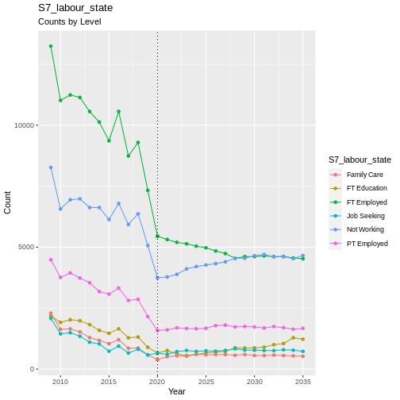
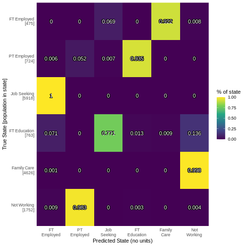
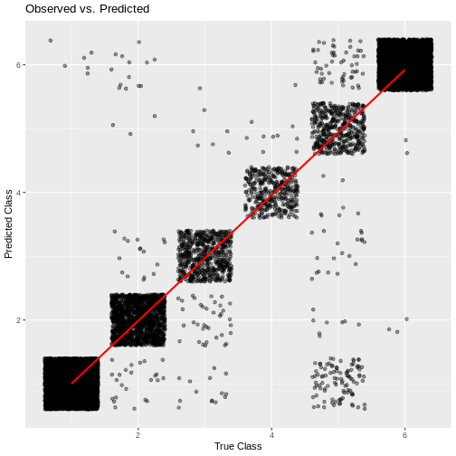
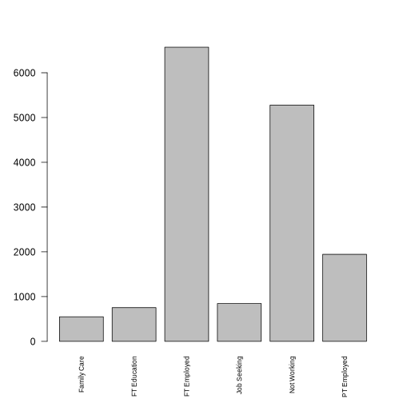
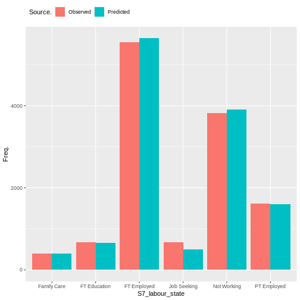

Labour
------

Labour state is a measure of what an individual does. There are 8
distinctive categories including employment, unemployment, and retired.
The encodings of these states can be found
[here]](https://leeds-mrg.github.io/Minos/documentation/data_tables.html).

|plot of chunk labour_barchart|\ |image1|

Transition Model
~~~~~~~~~~~~~~~~

Labour state is a complex categorical data type. Single layer neural
network is a simple way to estimate this state. Use multinom function
from R’s
`nnet <https://www.rdocumentation.org/packages/nnet/versions/7.3-20>`__
package. Formula for weights included given as.

.. math::   labour\_state \sim labour\_state_\_last + age + sex + ethnicity + region + education\_state  

Variables used in this model. Encodings for discrete variables found in
data tables.

-  sex. Biological sex male/female.
-  ethnicity. Ethnicity e.g. white british. XXXX cite.
-  age in years. XXXX cite.
-  education. Highest qualification attained. XXXX cite
-  sf12. Mental well-being score. XXXX cite
-  labour_state. Previous labour state. XXXX cite. Probably remove this.
   dominates prediction..
-  household income. Monthly disposable income of individuals household.
   XXXX cite.

===================== =========== ========================
Predictor             Description Literature/Justification
===================== =========== ========================
Previous Labour State             
Age                               
Sex                               
Ethnicity                         
Region                            
Education                         
===================== =========== ========================

Validation
~~~~~~~~~~

.. code:: r

   handover_ordinal(raw.dat, base.dat, v)

   plot of chunk S7_labour_state_validation

Results
~~~~~~~

-  hard to determine goodness of fit.
-  use confusion matrix to estimate quality of fit.
-  employed/retired well predicted. unemployed/student volatile socially
   and expectedly hard to predict.
-  some deterministic replacement needed for categories like student
   that have specific time frames. e.g. three years for a degree.

   plot of chunk labour_output

.. code:: r

   cumulative_link_plot(obs, preds)

::

   ## `geom_smooth()` using formula = 'y ~ x'

   plot of chunk labour_performance

References
~~~~~~~~~~

