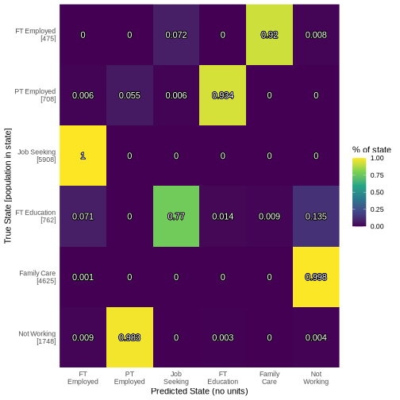

======
Labour
======

Labour
======

Labour state is a measure of what an individual does. There are 8
distinctive categories including employment, unemployment, and retired.
The encodings of these states can be found
[here]](https://leeds-mrg.github.io/Minos/documentation/data_tables.html).

|plot of chunk labour_barchart|\ |image1|

Methods
-------

Labour state is a complex categorical data type. Single layer neural
network is a simple way to estimate this state. Use multinom function
from R’s nnet package. Formula for weights included given as.

.. math:: labour\_state\_next = sex + ethnicity + age + education\_state + SF\_12 + housing\_quality + labour\_state + job\_sec + hh\_income + alcohol\_spending

Data
----

Variables used in this model. Encodings for discrete variables found in
data tables.

- sex. Biological sex male/female.
- ethnicity. Ethnicity e.g. white british. XXXX cite.
- age in years. XXXX cite.
- education. Highest qualification attained. XXXX cite
- sf12. Mental well-being score. XXXX cite
- housing quality. Number of household appliances. Ordinal 1-3. XXXX
  cite
- labour_state. Previous labour state. XXXX cite. Probably remove this.
  dominates prediction..
- nssec. Socioeconomic code of job. Indicates job quality with 1-9
  ordinal variable. XXXX cite
- household income. Monthly disposable income of individuals household.
  XXXX cite.
- alcohol spending. How much is spent on alcohol. XXXX cite. remove.

Results
-------

- hard to determine goodness of fit.
- use confusion matrix to estimate quality of fit.
- employed/retired well predicted. unemployed/student volatile socially
  and expectedly hard to predict.
- some deterministic replacement needed for categories like student that
  have specific time frames. e.g. three years for a degree.

   plot of chunk labour_output

References
----------

