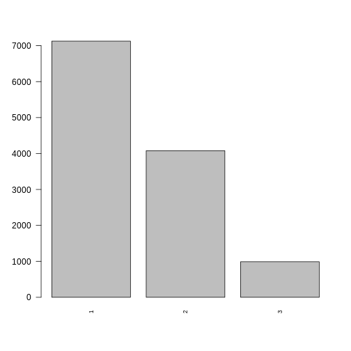
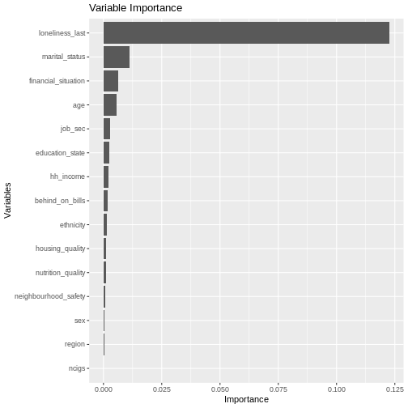
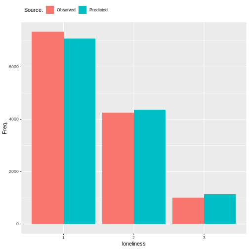
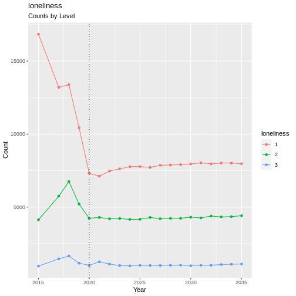
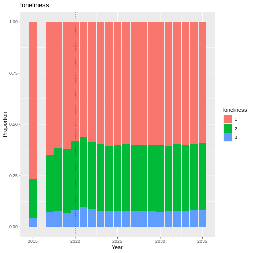

Loneliness
----------

A score for loneliness is taken directly from a US variable -
`sclonely <https://www.understandingsociety.ac.uk/documentation/mainstage/dataset-documentation/variable/sclonely>`__.
The questions used to output levels of loneliness in Understanding
Society come from the Government Statistical Service (GSS) harmonised
principle of loneliness. This means the outputs are comparable with
other surveys that use this principle. The GSS has a `guidance
page <https://analysisfunction.civilservice.gov.uk/policy-store/loneliness-indicators/>`__
which may be useful to understand what other data can and cannot be
compared with this output.

The ``sclonely`` variable is only available from wave 9 onwards, and is
an ordinal variable with 3 levels:

1 - Hardly ever or never 2 - Some of the time 3 - Often

This means that lower scores mean “better” subjective scores of
loneliness.

.. code:: r

   #discrete_barplot(obs, 'loneliness')
   order <- c(1, 2, 3)
   discrete_barplot(obs, order)

   plot of chunk loneliness_data

Transition Model
~~~~~~~~~~~~~~~~

To predict the next state of loneliness we use a Random Forest Ordinal
model from the
`ranger <https://www.rdocumentation.org/packages/ranger/versions/0.16.0>`__
package in R.

Formula:

.. math::   loneliness \sim loneliness\_last + age + sex + ethnicity + region + education\_state + housing\_quality + \\neighbourhood\_safety + nutrition\_quality + ncigs + job\_sec + hh\_income + \\marital\_status + behind\_on\_bills + financial\_situation  

Loneliness has been `linked with educational
attainment <https://www.tandfonline.com/doi/full/10.1080/03601270701569275?casa_token=3vV_r99mb0QAAAAA%3ACK8Wogj5cs5CQm8gZfLKuHJtctkCyGX_i2y4CLyDgAhsReGB1s7QrV1I0qul-6Gw75QBcY93WoWuWA>`__.
Higher educational attainment has been linked with lower levels of
stress and neuroticism, of which both have been linked with loneliness
(more neuroticism/stress linked to more loneliness).

Loneliness has been `linked with
ethnicity <https://bmcpublichealth.biomedcentral.com/articles/10.1186/s12889-020-09208-0>`__.
> The association between ethnicity and loneliness was stronger among
young and early middle-aged adults, compared to late middle-aged adults.

.. code:: r

   plot_rfo_importance(model)

   plot of chunk loneliness_model_summary

Validation
~~~~~~~~~~

.. code:: r

   handover_ordinal(raw.dat, base.dat, v)

|plot of chunk loneliness_validation|\ |image1|

Results
~~~~~~~

Random Forest Ordinal models from the ranger package cannot provide a
summary like some other models can, so instead we will look at plots of
observed vs predicted values as well as the importance of each variable
in the resulting model.

   plot of chunk loneliness_output

References
~~~~~~~~~~

