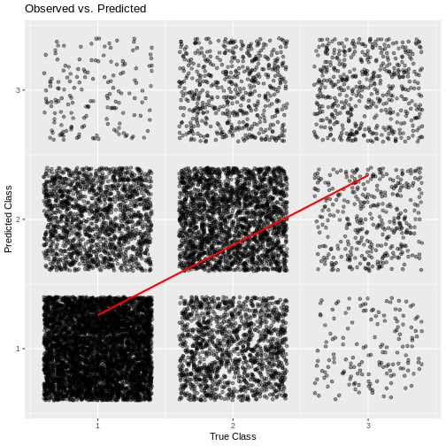

Loneliness
----------

A score for loneliness is taken directly from a US variable -
`sclonely <https://www.understandingsociety.ac.uk/documentation/mainstage/dataset-documentation/variable/sclonely>`__.
The questions used to output levels of loneliness in Understanding
Society come from the Government Statistical Service (GSS) harmonised
principle of loneliness. This means the outputs are comparable with
other surveys that use this principle. The GSS has a `guidance
page <https://analysisfunction.civilservice.gov.uk/policy-store/loneliness-indicators/>`__
which may be useful to understand what other data can and cannot be
compared with this output.

The ``sclonely`` variable is only available from wave 9 onwards, and is
an ordinal variable with 3 levels:

1 - Hardly ever or never 2 - Some of the time 3 - Often

This means that lower scores mean “better” subjective scores of
loneliness.

.. code:: r

   #discrete_barplot(obs, 'loneliness')
   order <- c(1, 2, 3)
   discrete_barplot(obs, order)

.. figure:: ./figure/loneliness_data-1.png
   :alt: plot of chunk loneliness_data

   plot of chunk loneliness_data

Transition Model
~~~~~~~~~~~~~~~~

To predict the next state of loneliness we use a Random Forest Ordinal
model from the
`ranger <https://www.rdocumentation.org/packages/ranger/versions/0.16.0>`__
package in R.

Formula:

.. math::   loneliness \sim loneliness\_last + age + sex + ethnicity + region + education\_state + housing\_quality + \\neighbourhood\_safety + nutrition\_quality + ncigs + labour\_state + job\_sec + hh\_income + \\marital\_status + behind\_on\_bills + financial\_situation + SF\_12  

Loneliness has been `linked with educational
attainment <https://www.tandfonline.com/doi/full/10.1080/03601270701569275?casa_token=3vV_r99mb0QAAAAA%3ACK8Wogj5cs5CQm8gZfLKuHJtctkCyGX_i2y4CLyDgAhsReGB1s7QrV1I0qul-6Gw75QBcY93WoWuWA>`__.
Higher educational attainment has been linked with lower levels of
stress and neuroticism, of which both have been linked with loneliness
(more neuroticism/stress linked to more loneliness).

Loneliness has been `linked with
ethnicity <https://bmcpublichealth.biomedcentral.com/articles/10.1186/s12889-020-09208-0>`__.
> The association between ethnicity and loneliness was stronger among
young and early middle-aged adults, compared to late middle-aged adults.

+--------------------+------------------------+------------------------+
| Predictor          | Description            | Li                     |
|                    |                        | terature/Justification |
+====================+========================+========================+
| Previous           |                        |                        |
| Loneliness         |                        |                        |
+--------------------+------------------------+------------------------+
| Age                |                        | (Franssen et al. 2020) |
|                    |                        | (Beutel et al. 2017)   |
+--------------------+------------------------+------------------------+
| Sex                |                        | (Franssen et al. 2020) |
|                    |                        | (Beutel et al. 2017)   |
+--------------------+------------------------+------------------------+
| Ethnicity          |                        |                        |
+--------------------+------------------------+------------------------+
| Region             | Administrative region  |                        |
|                    | of the UK              |                        |
+--------------------+------------------------+------------------------+
| Education          | Highest attained       | (Bishop and Martin     |
|                    | qualification          | 2007) (Franssen et al. |
|                    |                        | 2020)                  |
+--------------------+------------------------+------------------------+
| Housing Quality    |                        |                        |
+--------------------+------------------------+------------------------+
| Neighbourhood      |                        |                        |
| Safety             |                        |                        |
+--------------------+------------------------+------------------------+
| Nutrition Quality  |                        |                        |
+--------------------+------------------------+------------------------+
| Tobacco            |                        | (Beutel et al. 2017)   |
| Consumption        |                        |                        |
+--------------------+------------------------+------------------------+
| Labour State       |                        | (Morrish and           |
|                    |                        | Medina-Lara 2021)      |
|                    |                        | (Moens et al. 2021)    |
+--------------------+------------------------+------------------------+
| Job NSSEC          | 8 level socio-economic | (Morrish and           |
|                    | employment category    | Medina-Lara 2021)      |
|                    |                        | (Moens et al. 2021)    |
+--------------------+------------------------+------------------------+
| Household Income   |                        | (Franssen et al. 2020) |
+--------------------+------------------------+------------------------+
| Marital Status     |                        | (Franssen et al. 2020) |
|                    |                        | (Beutel et al. 2017)   |
+--------------------+------------------------+------------------------+
| Behind on Bills    |                        |                        |
+--------------------+------------------------+------------------------+
| Financial          |                        | (Franssen et al. 2020) |
| Situation          |                        |                        |
+--------------------+------------------------+------------------------+
| SF-12 MCS          |                        | (Franssen et al. 2020) |
+--------------------+------------------------+------------------------+

.. code:: r

   plot_rfo_importance(model)

.. figure:: ./figure/loneliness_model_summary-1.png
   :alt: plot of chunk loneliness_model_summary

   plot of chunk loneliness_model_summary

Validation
~~~~~~~~~~

.. code:: r

   handover_ordinal(raw.dat, base.dat, v)

.. figure:: ./figure/loneliness_validation-1.png
   :alt: plot of chunk loneliness_validation

   plot of chunk loneliness_validation

Results
~~~~~~~

Random Forest Ordinal models from the ranger package cannot provide a
summary like some other models can, so instead we will look at plots of
observed vs predicted values as well as the importance of each variable
in the resulting model.

.. figure:: ./figure/loneliness_output-1.png
   :alt: plot of chunk loneliness_output

   plot of chunk loneliness_output

.. code:: r

   cumulative_link_plot(obs, preds)

::

   ## `geom_smooth()` using formula = 'y ~ x'

   plot of chunk loneliness_performance

References
~~~~~~~~~~

.. container:: references csl-bib-body hanging-indent
   :name: refs

   .. container:: csl-entry
      :name: ref-beutel2017loneliness

      Beutel, Manfred E, Eva M Klein, Elmar Brähler, Iris Reiner, Claus
      Jünger, Matthias Michal, Jörg Wiltink, et al. 2017. “Loneliness in
      the General Population: Prevalence, Determinants and Relations to
      Mental Health.” *BMC Psychiatry* 17: 1–7.

   .. container:: csl-entry
      :name: ref-bishop2007indirect

      Bishop, Alex J, and Peter Martin. 2007. “The Indirect Influence of
      Educational Attainment on Loneliness Among Unmarried Older
      Adults.” *Educational Gerontology* 33 (10): 897–917.

   .. container:: csl-entry
      :name: ref-franssen2020age

      Franssen, Thanée, Mandy Stijnen, Femke Hamers, and Francine
      Schneider. 2020. “Age Differences in Demographic, Social and
      Health-Related Factors Associated with Loneliness Across the Adult
      Life Span (19–65 Years): A Cross-Sectional Study in the
      Netherlands.” *BMC Public Health* 20: 1–12.

   .. container:: csl-entry
      :name: ref-moens2021does

      Moens, Eline, Stijn Baert, Elsy Verhofstadt, and Luc Van Ootegem.
      2021. “Does Loneliness Lurk in Temp Work? Exploring the
      Associations Between Temporary Employment, Loneliness at Work and
      Job Satisfaction.” *PLoS One* 16 (5): e0250664.

   .. container:: csl-entry
      :name: ref-morrish2021does

      Morrish, N, and A Medina-Lara. 2021. “Does Unemployment Lead to
      Greater Levels of Loneliness? A Systematic Review.” *Social
      Science & Medicine* 287: 114339.
