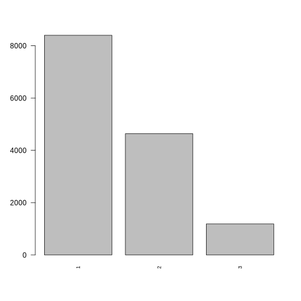

==========
Loneliness
==========

Loneliness
==========

Introductory fluff. Why do we need this module? test reference (Nelson
1987).

Methods
-------

What methods are used? Justification due to output data type.
explanation of model output.

.. code:: r

   discrete_barplot("loneliness")

   plot of chunk loneliness_data

Data
----

What variables are included? Why is this output chosen. What explanatory
variables are used and why are they chosen

Results
-------

What are the results. Coefficients tables. diagnostic plots. measures of
goodness of fit.

.. figure:: ./figure/housing_output-1.png
   :alt: plot of chunk housing_output

   plot of chunk housing_output

::

   ## formula: 
   ## loneliness_next ~ factor(sex) + scale(age) + scale(SF_12) + factor(labour_state) + factor(ethnicity) + scale(hh_income) + alcohol_spending + ncigs
   ## data:    data
   ## 
   ##  link  threshold nobs  logLik    AIC      niter max.grad cond.H 
   ##  logit flexible  19415 -14800.00 29654.00 6(0)  6.67e-07 1.0e+07
   ## 
   ## Coefficients:
   ##                                       Estimate Std. Error z value Pr(>|z|)    
   ## factor(sex)Male                     -0.3004708  0.0327233  -9.182  < 2e-16 ***
   ## scale(age)                          -0.1226539  0.0253339  -4.841 1.29e-06 ***
   ## scale(SF_12)                        -0.8178164  0.0170166 -48.060  < 2e-16 ***
   ## factor(labour_state)Family Care      0.1316331  0.0862416   1.526 0.126928    
   ## factor(labour_state)Maternity Leave -0.2765143  0.1950482  -1.418 0.156287    
   ## factor(labour_state)PT Employed      0.0797832  0.0534149   1.494 0.135267    
   ## factor(labour_state)Retired          0.1759821  0.0570212   3.086 0.002027 ** 
   ## factor(labour_state)Self-employed    0.0197607  0.0612821   0.322 0.747108    
   ## factor(labour_state)Sick/Disabled    0.7691415  0.0895790   8.586  < 2e-16 ***
   ## factor(labour_state)Student          0.2480798  0.0713041   3.479 0.000503 ***
   ## factor(labour_state)Unemployed       0.2930554  0.0855424   3.426 0.000613 ***
   ## factor(ethnicity)BLA                 0.1561325  0.1668044   0.936 0.349262    
   ## factor(ethnicity)BLC                 0.3485061  0.1633377   2.134 0.032871 *  
   ## factor(ethnicity)CHI                -0.0384768  0.2515971  -0.153 0.878453    
   ## factor(ethnicity)IND                 0.1288456  0.1407821   0.915 0.360080    
   ## factor(ethnicity)MIX                 0.1073370  0.1575593   0.681 0.495715    
   ## factor(ethnicity)OAS                 0.4034540  0.1816202   2.221 0.026323 *  
   ## factor(ethnicity)OBL                -0.4167904  0.4491905  -0.928 0.353475    
   ## factor(ethnicity)OTH                 0.0651488  0.2906450   0.224 0.822639    
   ## factor(ethnicity)PAK                -0.0953418  0.1473989  -0.647 0.517743    
   ## factor(ethnicity)WBI                -0.0274590  0.1199839  -0.229 0.818981    
   ## factor(ethnicity)WHO                -0.0345249  0.1409714  -0.245 0.806528    
   ## scale(hh_income)                    -0.0795816  0.0163490  -4.868 1.13e-06 ***
   ## alcohol_spending                    -0.0002397  0.0001879  -1.276 0.202088    
   ## ncigs                                0.0210371  0.0032054   6.563 5.27e-11 ***
   ## ---
   ## Signif. codes:  0 '***' 0.001 '**' 0.01 '*' 0.05 '.' 0.1 ' ' 1
   ## 
   ## Threshold coefficients:
   ##     Estimate Std. Error z value
   ## 1|2   0.4763     0.1224   3.891
   ## 2|3   2.8578     0.1253  22.814

References
----------

.. container:: references csl-bib-body hanging-indent
   :name: refs

   .. container:: csl-entry
      :name: ref-1987:nelson

      Nelson, Edward. 1987. *Radically Elementary Probability Theory*.
      Princeton University Press.
