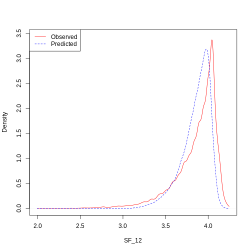
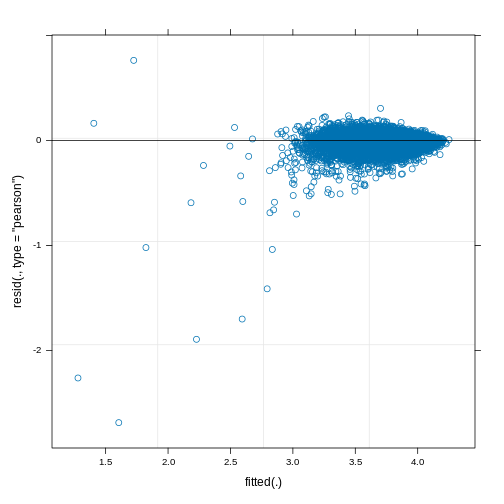

Mental Well-Being
-----------------

Introduction.
~~~~~~~~~~~~~

Prediction of future Short Form 12 Mental Component Score (SF-12 MCS).

Methods
~~~~~~~

What methods are used? Justification due to output data type.
explanation of model output.

Data
~~~~

What variables are included? Why is this output chosen. What explanatory
variables are used and why are they chosen

Results
~~~~~~~

What are the results. Coefficients tables. diagnostic plots. measures of
goodness of fit.

   plot of chunk SF12_Output

::

   ## Linear mixed model fit by REML ['lmerMod']
   ## Formula: SF_12 ~ time + scale(SF_12_last) + scale(age) + factor(sex) +  
   ##     relevel(factor(ethnicity), ref = "WBI") + relevel(factor(region),  
   ##     ref = "Scotland") + relevel(factor(education_state), ref = "1") +  
   ##     scale(hh_income) + factor(housing_quality) + factor(neighbourhood_safety) +  
   ##     factor(loneliness) + scale(nutrition_quality) + scale(ncigs) +      I(factor(ncigs > 0)) + (1 | pidp)
   ##    Data: data
   ## Weights: weight
   ## 
   ## REML criterion at convergence: Inf
   ## 
   ## Scaled residuals: 
   ##     Min      1Q  Median      3Q     Max 
   ## -52.450  -0.247   0.105   0.405   7.284 
   ## 
   ## Random effects:
   ##  Groups   Name        Variance  Std.Dev.
   ##  pidp     (Intercept) 0.0014178 0.03765 
   ##  Residual             0.0004727 0.02174 
   ## Number of obs: 59676, groups:  pidp, 30476
   ## 
   ## Fixed effects:
   ##                                                                     Estimate Std. Error t value
   ## (Intercept)                                                        3.918e+00  8.278e-01   4.733
   ## time                                                              -1.945e-05  4.106e-04  -0.047
   ## scale(SF_12_last)                                                  1.191e-01  1.071e-03 111.194
   ## scale(age)                                                         2.128e-02  1.128e-03  18.863
   ## factor(sex)Male                                                    2.104e-02  2.035e-03  10.337
   ## relevel(factor(ethnicity), ref = "WBI")BAN                        -6.030e-03  1.362e-02  -0.443
   ## relevel(factor(ethnicity), ref = "WBI")BLA                         3.439e-02  8.473e-03   4.058
   ## relevel(factor(ethnicity), ref = "WBI")BLC                         1.939e-02  1.134e-02   1.711
   ## relevel(factor(ethnicity), ref = "WBI")CHI                         1.890e-02  1.439e-02   1.313
   ## relevel(factor(ethnicity), ref = "WBI")IND                         5.288e-03  6.472e-03   0.817
   ## relevel(factor(ethnicity), ref = "WBI")MIX                         1.870e-04  8.407e-03   0.022
   ## relevel(factor(ethnicity), ref = "WBI")OAS                        -7.198e-03  9.122e-03  -0.789
   ## relevel(factor(ethnicity), ref = "WBI")OBL                         3.491e-03  3.059e-02   0.114
   ## relevel(factor(ethnicity), ref = "WBI")OTH                        -2.640e-02  1.515e-02  -1.743
   ## relevel(factor(ethnicity), ref = "WBI")PAK                         6.466e-03  7.903e-03   0.818
   ## relevel(factor(ethnicity), ref = "WBI")WHO                         1.346e-02  4.761e-03   2.826
   ## relevel(factor(region), ref = "Scotland")East Midlands             9.260e-03  5.140e-03   1.802
   ## relevel(factor(region), ref = "Scotland")East of England           4.998e-03  4.849e-03   1.031
   ## relevel(factor(region), ref = "Scotland")London                   -4.358e-03  4.915e-03  -0.887
   ## relevel(factor(region), ref = "Scotland")North East               -3.665e-03  6.078e-03  -0.603
   ## relevel(factor(region), ref = "Scotland")North West                1.663e-03  4.752e-03   0.350
   ## relevel(factor(region), ref = "Scotland")South East                4.518e-04  4.534e-03   0.100
   ## relevel(factor(region), ref = "Scotland")South West               -2.624e-03  4.972e-03  -0.528
   ## relevel(factor(region), ref = "Scotland")Wales                    -7.163e-03  6.253e-03  -1.145
   ## relevel(factor(region), ref = "Scotland")West Midlands            -3.927e-03  5.005e-03  -0.785
   ## relevel(factor(region), ref = "Scotland")Yorkshire and The Humber  1.097e-03  4.960e-03   0.221
   ## relevel(factor(education_state), ref = "1")0                      -1.857e-03  7.559e-03  -0.246
   ## relevel(factor(education_state), ref = "1")2                       4.328e-03  7.580e-03   0.571
   ## relevel(factor(education_state), ref = "1")3                      -1.710e-03  7.934e-03  -0.215
   ## relevel(factor(education_state), ref = "1")5                       8.216e-03  7.995e-03   1.028
   ## relevel(factor(education_state), ref = "1")6                       2.264e-03  7.670e-03   0.295
   ## relevel(factor(education_state), ref = "1")7                       8.499e-04  7.834e-03   0.108
   ## scale(hh_income)                                                   7.967e-03  1.033e-03   7.716
   ## factor(housing_quality)Low                                        -7.089e-03  3.078e-03  -2.304
   ## factor(housing_quality)Medium                                      5.578e-03  3.648e-03   1.529
   ## factor(neighbourhood_safety)2                                      4.850e-03  2.389e-03   2.030
   ## factor(neighbourhood_safety)3                                      1.192e-02  3.196e-03   3.730
   ## factor(loneliness)2                                               -7.955e-02  2.372e-03 -33.534
   ## factor(loneliness)3                                               -2.547e-01  4.161e-03 -61.198
   ## scale(nutrition_quality)                                           7.067e-03  1.019e-03   6.932
   ## scale(ncigs)                                                      -6.203e-03  1.476e-03  -4.203
   ## I(factor(ncigs > 0))TRUE                                          -1.435e-02  4.565e-03  -3.144

::

   ## 
   ## Correlation matrix not shown by default, as p = 42 > 12.
   ## Use print(summary(model), correlation=TRUE)  or
   ##     vcov(summary(model))        if you need it

::

   ## optimizer (nloptwrap) convergence code: 0 (OK)
   ## Gradient contains NAs

   plot of chunk SF12_Output

References
~~~~~~~~~~
