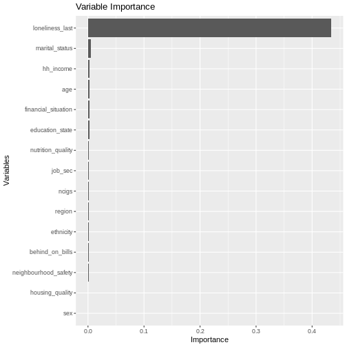
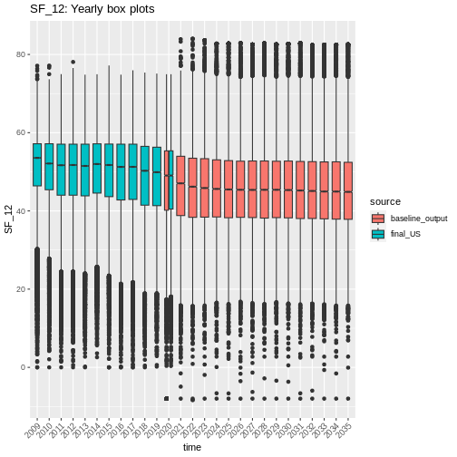

Mental Well-Being
-----------------

Mental wellbeing is one of the key output of MINOS.

To measure mental wellbeing, we use the Short-Form 12 Mental Component
Score (SF-12 MCS). The Short-Form 12 survey is a survey consisting of 12
questions relating to both physical and mental health. `See
here <https://www.england.nhs.uk/wp-content/uploads/2022/12/Short-form-12-health-survey-questionnaire.pdf>`__
for a copy of the survey. Summary scores for both mental and physical
health can be calculated from the responses, leading to the Mental
Component Score (MCS). MCS is a measure ranging from 0 (low functioning)
to 100 (high functioning). SF-12 MCS is represented by a variable
directly from the survey -
```sf12mcs_dv`` <https://www.understandingsociety.ac.uk/documentation/mainstage/variables/sf12mcs_dv/>`__.
Each of the responses to the 12 questions are also available in the
survey.

.. code:: r

   continuous_density(obs)



   plot of chunk unnamed-chunk-1

Transition Model
~~~~~~~~~~~~~~~~

We use a Linear Mixed Model (LMM) from the
`lme4 <https://www.rdocumentation.org/packages/lme4/versions/1.1-36>`__
package in R.

Formula:

.. math::   SF\_12 \sim SF\_12\_last + age + sex + ethnicity + region + education\_state + hh\_income + \\housing\_quality + neighbourhood\_safety + loneliness + nutrition\_quality + ncigs + \\I(ncigs>0) + (1|pidp)  

.. code:: r

   print(summary(model))

::

   ## Linear mixed model fit by REML ['lmerMod']
   ## Formula: SF_12 ~ time + scale(SF_12_last) + scale(age) + factor(sex) +  
   ##     relevel(factor(ethnicity), ref = "WBI") + relevel(factor(region),  
   ##     ref = "Scotland") + relevel(factor(education_state), ref = "1") +  
   ##     scale(hh_income) + factor(housing_quality) + factor(neighbourhood_safety) +  
   ##     factor(loneliness) + scale(nutrition_quality) + scale(ncigs) +  
   ##     I(factor(ncigs > 0)) + (1 | pidp)
   ##    Data: data
   ## Weights: weight
   ## 
   ## REML criterion at convergence: Inf
   ## 
   ## Scaled residuals: 
   ##     Min      1Q  Median      3Q     Max 
   ## -56.577  -0.245   0.098   0.388  16.055 
   ## 
   ## Random effects:
   ##  Groups   Name        Variance Std.Dev.
   ##  pidp     (Intercept) 0.006622 0.08138 
   ##  Residual             0.002256 0.04750 
   ## Number of obs: 54222, groups:  pidp, 28092
   ## 
   ## Fixed effects:
   ##                                                                     Estimate
   ## (Intercept)                                                        4.9130360
   ## time                                                              -0.0005121
   ## scale(SF_12_last)                                                  0.1147985
   ## scale(age)                                                         0.0213196
   ## factor(sex)Male                                                    0.0201720
   ## relevel(factor(ethnicity), ref = "WBI")BAN                         0.0003187
   ## relevel(factor(ethnicity), ref = "WBI")BLA                         0.0292479
   ## relevel(factor(ethnicity), ref = "WBI")BLC                         0.0182469
   ## relevel(factor(ethnicity), ref = "WBI")CHI                         0.0156511
   ## relevel(factor(ethnicity), ref = "WBI")IND                        -0.0006695
   ## relevel(factor(ethnicity), ref = "WBI")MIX                        -0.0035134
   ## relevel(factor(ethnicity), ref = "WBI")OAS                        -0.0014412
   ## relevel(factor(ethnicity), ref = "WBI")OBL                        -0.0010133
   ## relevel(factor(ethnicity), ref = "WBI")OTH                        -0.0698175
   ## relevel(factor(ethnicity), ref = "WBI")PAK                         0.0055012
   ## relevel(factor(ethnicity), ref = "WBI")WHO                         0.0153347
   ## relevel(factor(region), ref = "Scotland")East Midlands             0.0111865
   ## relevel(factor(region), ref = "Scotland")East of England           0.0051782
   ## relevel(factor(region), ref = "Scotland")London                    0.0015323
   ## relevel(factor(region), ref = "Scotland")North East               -0.0045409
   ## relevel(factor(region), ref = "Scotland")North West                0.0017339
   ## relevel(factor(region), ref = "Scotland")Northern Ireland          0.0007918
   ## relevel(factor(region), ref = "Scotland")South East                0.0018979
   ## relevel(factor(region), ref = "Scotland")South West               -0.0022500
   ## relevel(factor(region), ref = "Scotland")Wales                    -0.0052198
   ## relevel(factor(region), ref = "Scotland")West Midlands            -0.0012001
   ## relevel(factor(region), ref = "Scotland")Yorkshire and The Humber  0.0010756
   ## relevel(factor(education_state), ref = "1")0                      -0.0077798
   ## relevel(factor(education_state), ref = "1")2                       0.0042615
   ## relevel(factor(education_state), ref = "1")3                       0.0007321
   ## relevel(factor(education_state), ref = "1")5                       0.0107276
   ## relevel(factor(education_state), ref = "1")6                       0.0025737
   ## relevel(factor(education_state), ref = "1")7                       0.0005953
   ## scale(hh_income)                                                   0.0058139
   ## factor(housing_quality)Medium                                     -0.0034585
   ## factor(housing_quality)Low                                        -0.0333141
   ## factor(neighbourhood_safety)2                                      0.0040435
   ## factor(neighbourhood_safety)3                                      0.0164410
   ## factor(loneliness)2                                               -0.0767773
   ## factor(loneliness)3                                               -0.2659751
   ## scale(nutrition_quality)                                           0.0091674
   ## scale(ncigs)                                                      -0.0060226
   ## I(factor(ncigs > 0))TRUE                                          -0.0132155
   ##                                                                   Std. Error
   ## (Intercept)                                                        0.8338147
   ## time                                                               0.0004135
   ## scale(SF_12_last)                                                  0.0011464
   ## scale(age)                                                         0.0012655
   ## factor(sex)Male                                                    0.0022776
   ## relevel(factor(ethnicity), ref = "WBI")BAN                         0.0142276
   ## relevel(factor(ethnicity), ref = "WBI")BLA                         0.0092479
   ## relevel(factor(ethnicity), ref = "WBI")BLC                         0.0120408
   ## relevel(factor(ethnicity), ref = "WBI")CHI                         0.0170623
   ## relevel(factor(ethnicity), ref = "WBI")IND                         0.0070907
   ## relevel(factor(ethnicity), ref = "WBI")MIX                         0.0092666
   ## relevel(factor(ethnicity), ref = "WBI")OAS                         0.0101210
   ## relevel(factor(ethnicity), ref = "WBI")OBL                         0.0326498
   ## relevel(factor(ethnicity), ref = "WBI")OTH                         0.0181015
   ## relevel(factor(ethnicity), ref = "WBI")PAK                         0.0083659
   ## relevel(factor(ethnicity), ref = "WBI")WHO                         0.0055417
   ## relevel(factor(region), ref = "Scotland")East Midlands             0.0058743
   ## relevel(factor(region), ref = "Scotland")East of England           0.0055548
   ## relevel(factor(region), ref = "Scotland")London                    0.0057055
   ## relevel(factor(region), ref = "Scotland")North East                0.0069722
   ## relevel(factor(region), ref = "Scotland")North West                0.0055007
   ## relevel(factor(region), ref = "Scotland")Northern Ireland          0.0079141
   ## relevel(factor(region), ref = "Scotland")South East                0.0052191
   ## relevel(factor(region), ref = "Scotland")South West                0.0056514
   ## relevel(factor(region), ref = "Scotland")Wales                     0.0071922
   ## relevel(factor(region), ref = "Scotland")West Midlands             0.0057215
   ## relevel(factor(region), ref = "Scotland")Yorkshire and The Humber  0.0057132
   ## relevel(factor(education_state), ref = "1")0                       0.0084666
   ## relevel(factor(education_state), ref = "1")2                       0.0084449
   ## relevel(factor(education_state), ref = "1")3                       0.0088360
   ## relevel(factor(education_state), ref = "1")5                       0.0089127
   ## relevel(factor(education_state), ref = "1")6                       0.0085489
   ## relevel(factor(education_state), ref = "1")7                       0.0087401
   ## scale(hh_income)                                                   0.0011283
   ## factor(housing_quality)Medium                                      0.0023848
   ## factor(housing_quality)Low                                         0.0040415
   ## factor(neighbourhood_safety)2                                      0.0025319
   ## factor(neighbourhood_safety)3                                      0.0033646
   ## factor(loneliness)2                                                0.0025716
   ## factor(loneliness)3                                                0.0045929
   ## scale(nutrition_quality)                                           0.0011009
   ## scale(ncigs)                                                       0.0014733
   ## I(factor(ncigs > 0))TRUE                                           0.0049761
   ##                                                                   t value
   ## (Intercept)                                                         5.892
   ## time                                                               -1.238
   ## scale(SF_12_last)                                                 100.137
   ## scale(age)                                                         16.846
   ## factor(sex)Male                                                     8.857
   ## relevel(factor(ethnicity), ref = "WBI")BAN                          0.022
   ## relevel(factor(ethnicity), ref = "WBI")BLA                          3.163
   ## relevel(factor(ethnicity), ref = "WBI")BLC                          1.515
   ## relevel(factor(ethnicity), ref = "WBI")CHI                          0.917
   ## relevel(factor(ethnicity), ref = "WBI")IND                         -0.094
   ## relevel(factor(ethnicity), ref = "WBI")MIX                         -0.379
   ## relevel(factor(ethnicity), ref = "WBI")OAS                         -0.142
   ## relevel(factor(ethnicity), ref = "WBI")OBL                         -0.031
   ## relevel(factor(ethnicity), ref = "WBI")OTH                         -3.857
   ## relevel(factor(ethnicity), ref = "WBI")PAK                          0.658
   ## relevel(factor(ethnicity), ref = "WBI")WHO                          2.767
   ## relevel(factor(region), ref = "Scotland")East Midlands              1.904
   ## relevel(factor(region), ref = "Scotland")East of England            0.932
   ## relevel(factor(region), ref = "Scotland")London                     0.269
   ## relevel(factor(region), ref = "Scotland")North East                -0.651
   ## relevel(factor(region), ref = "Scotland")North West                 0.315
   ## relevel(factor(region), ref = "Scotland")Northern Ireland           0.100
   ## relevel(factor(region), ref = "Scotland")South East                 0.364
   ## relevel(factor(region), ref = "Scotland")South West                -0.398
   ## relevel(factor(region), ref = "Scotland")Wales                     -0.726
   ## relevel(factor(region), ref = "Scotland")West Midlands             -0.210
   ## relevel(factor(region), ref = "Scotland")Yorkshire and The Humber   0.188
   ## relevel(factor(education_state), ref = "1")0                       -0.919
   ## relevel(factor(education_state), ref = "1")2                        0.505
   ## relevel(factor(education_state), ref = "1")3                        0.083
   ## relevel(factor(education_state), ref = "1")5                        1.204
   ## relevel(factor(education_state), ref = "1")6                        0.301
   ## relevel(factor(education_state), ref = "1")7                        0.068
   ## scale(hh_income)                                                    5.153
   ## factor(housing_quality)Medium                                      -1.450
   ## factor(housing_quality)Low                                         -8.243
   ## factor(neighbourhood_safety)2                                       1.597
   ## factor(neighbourhood_safety)3                                       4.886
   ## factor(loneliness)2                                               -29.856
   ## factor(loneliness)3                                               -57.910
   ## scale(nutrition_quality)                                            8.328
   ## scale(ncigs)                                                       -4.088
   ## I(factor(ncigs > 0))TRUE                                           -2.656

::

   ## 
   ## Correlation matrix not shown by default, as p = 43 > 12.
   ## Use print(summary(model), correlation=TRUE)  or
   ##     vcov(summary(model))        if you need it

::

   ## optimizer (nloptwrap) convergence code: 0 (OK)
   ## Gradient contains NAs

Validation
~~~~~~~~~~

.. code:: r

   handover_boxplots(raw.dat, base.dat, v)



   plot of chunk mwb_validation

.. code:: r

   #handover_lineplots(raw.dat, base.dat, v)

Results
~~~~~~~

|plot of chunk SF12_Output|\ |image1|

References
~~~~~~~~~~

.. |plot of chunk SF12_Output| image:: ./figure/SF12_Output-1.png
.. |image1| image:: ./figure/SF12_Output-2.png
