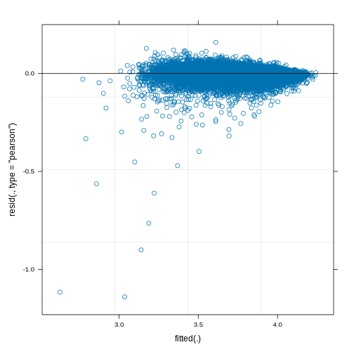

=================
Mental Well-Being
=================

Mental Well-Being
=================

Introductory fluff. Why do we need this module? test reference (Nelson
1987).

Methods
-------

What methods are used? Justification due to output data type.
explanation of model output.

Data
----

What variables are included? Why is this output chosen. What explanatory
variables are used and why are they chosen

Results
-------

What are the results. Coefficients tables. diagnostic plots. measures of
goodness of fit.

   plot of chunk SF12_Output

::

   ## Linear mixed model fit by REML ['lmerMod']
   ## Formula: SF_12 ~ time + scale(SF_12_last) + scale(age) + factor(sex) +  
   ##     relevel(factor(ethnicity), ref = "WBI") + relevel(factor(region),  
   ##     ref = "Scotland") + relevel(factor(education_state), ref = "1") +  
   ##     scale(hh_income) + factor(housing_quality) + factor(neighbourhood_safety) +  
   ##     factor(loneliness) + scale(nutrition_quality) + scale(ncigs) +      I(factor(ncigs > 0)) + (1 | pidp)
   ##    Data: data
   ## Weights: weight
   ## 
   ## REML criterion at convergence: Inf
   ## 
   ## Scaled residuals: 
   ##     Min      1Q  Median      3Q     Max 
   ## -52.434  -0.248   0.105   0.405   7.282 
   ## 
   ## Random effects:
   ##  Groups   Name        Variance  Std.Dev.
   ##  pidp     (Intercept) 0.0014182 0.03766 
   ##  Residual             0.0004728 0.02174 
   ## Number of obs: 59647, groups:  pidp, 30468
   ## 
   ## Fixed effects:
   ##                                                                     Estimate Std. Error t value
   ## (Intercept)                                                        3.872e+00  8.277e-01   4.678
   ## time                                                               2.752e-06  4.105e-04   0.007
   ## scale(SF_12_last)                                                  1.191e-01  1.071e-03 111.155
   ## scale(age)                                                         2.144e-02  1.127e-03  19.014
   ## factor(sex)Male                                                    2.114e-02  2.036e-03  10.384
   ## relevel(factor(ethnicity), ref = "WBI")BAN                        -6.061e-03  1.362e-02  -0.445
   ## relevel(factor(ethnicity), ref = "WBI")BLA                         3.433e-02  8.474e-03   4.052
   ## relevel(factor(ethnicity), ref = "WBI")BLC                         1.947e-02  1.134e-02   1.717
   ## relevel(factor(ethnicity), ref = "WBI")CHI                         1.847e-02  1.445e-02   1.278
   ## relevel(factor(ethnicity), ref = "WBI")IND                         5.260e-03  6.472e-03   0.813
   ## relevel(factor(ethnicity), ref = "WBI")MIX                        -1.462e-04  8.408e-03  -0.017
   ## relevel(factor(ethnicity), ref = "WBI")OAS                        -7.160e-03  9.122e-03  -0.785
   ## relevel(factor(ethnicity), ref = "WBI")OBL                         2.532e-03  3.059e-02   0.083
   ## relevel(factor(ethnicity), ref = "WBI")OTH                        -2.617e-02  1.515e-02  -1.728
   ## relevel(factor(ethnicity), ref = "WBI")PAK                         6.214e-03  7.905e-03   0.786
   ## relevel(factor(ethnicity), ref = "WBI")WHO                         1.388e-02  4.768e-03   2.910
   ## relevel(factor(region), ref = "Scotland")East Midlands             9.166e-03  5.140e-03   1.783
   ## relevel(factor(region), ref = "Scotland")East of England           4.925e-03  4.849e-03   1.016
   ## relevel(factor(region), ref = "Scotland")London                   -4.619e-03  4.916e-03  -0.940
   ## relevel(factor(region), ref = "Scotland")North East               -3.770e-03  6.078e-03  -0.620
   ## relevel(factor(region), ref = "Scotland")North West                1.512e-03  4.752e-03   0.318
   ## relevel(factor(region), ref = "Scotland")South East                4.501e-04  4.535e-03   0.099
   ## relevel(factor(region), ref = "Scotland")South West               -2.727e-03  4.972e-03  -0.548
   ## relevel(factor(region), ref = "Scotland")Wales                    -7.245e-03  6.254e-03  -1.158
   ## relevel(factor(region), ref = "Scotland")West Midlands            -3.908e-03  5.005e-03  -0.781
   ## relevel(factor(region), ref = "Scotland")Yorkshire and The Humber  1.180e-03  4.960e-03   0.238
   ## relevel(factor(education_state), ref = "1")0                      -1.768e-03  7.561e-03  -0.234
   ## relevel(factor(education_state), ref = "1")2                       4.333e-03  7.582e-03   0.572
   ## relevel(factor(education_state), ref = "1")3                      -1.714e-03  7.937e-03  -0.216
   ## relevel(factor(education_state), ref = "1")5                       8.132e-03  7.997e-03   1.017
   ## relevel(factor(education_state), ref = "1")6                       2.221e-03  7.671e-03   0.289
   ## relevel(factor(education_state), ref = "1")7                       8.276e-04  7.836e-03   0.106
   ## scale(hh_income)                                                   7.931e-03  1.033e-03   7.674
   ## factor(housing_quality)Low                                        -7.105e-03  3.078e-03  -2.309
   ## factor(housing_quality)Medium                                      5.485e-03  3.648e-03   1.504
   ## factor(neighbourhood_safety)2                                      4.805e-03  2.389e-03   2.011
   ## factor(neighbourhood_safety)3                                      1.175e-02  3.197e-03   3.674
   ## factor(loneliness)2                                               -7.947e-02  2.373e-03 -33.492
   ## factor(loneliness)3                                               -2.549e-01  4.161e-03 -61.256
   ## scale(nutrition_quality)                                           7.071e-03  1.020e-03   6.932
   ## scale(ncigs)                                                      -1.019e-02  2.094e-03  -4.868
   ## I(factor(ncigs > 0))TRUE                                          -3.769e-03  6.152e-03  -0.613

::

   ## 
   ## Correlation matrix not shown by default, as p = 42 > 12.
   ## Use print(summary(model), correlation=TRUE)  or
   ##     vcov(summary(model))        if you need it

::

   ## optimizer (nloptwrap) convergence code: 0 (OK)
   ## Gradient contains NAs

   plot of chunk SF12_Output

References
----------

.. container:: references csl-bib-body hanging-indent
   :name: refs

   .. container:: csl-entry
      :name: ref-1987:nelson

      Nelson, Edward. 1987. *Radically Elementary Probability Theory*.
      Princeton University Press.
