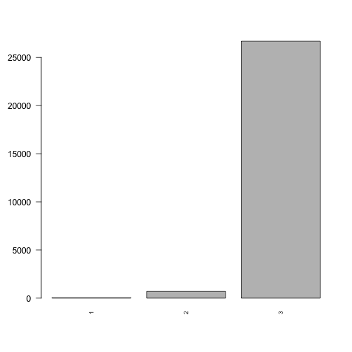

=============
Neighbourhood
=============

Neighbourhood
=============

Neighbourhood quality is an indicator of well-being suggested by the
SIPHER-7 XXXX ref and others?.

Methods
-------

::

   ## 
   ##     1     2     3 
   ##    45   697 26681

   plot of chunk neighbourhood_barchart

::

   ## [1] "/Users/robertclay/minos/docsrc/documentation/notebooks"

Neighbourhood data are presented as a likert scale from 1-6 indicating
the number of harmful activities that happen in a persons neighbourhood
for individual health. These include robberies and vandalism with the
full encoding available in the data tables.

Data
----

What variables are included? Why is this output chosen. What explanatory
variables are used and why are they chosen

Results
-------

What are the results. Coefficients tables. diagnostic plots. measures of
goodness of fit.

.. figure:: ./figure/housing_output-1.png
   :alt: plot of chunk housing_output

   plot of chunk housing_output

::

   ## formula: 
   ## neighbourhood_safety_next ~ sex + age + SF_12 + labour_state + ethnicity + hh_income + housing_quality + region + education_state
   ## data:    data
   ## 
   ##  link  threshold nobs  logLik   AIC     niter max.grad cond.H 
   ##  logit flexible  22627 -2733.40 5554.80 8(0)  2.47e-07 2.2e+09
   ## 
   ## Coefficients:
   ##                                  Estimate Std. Error z value Pr(>|z|)    
   ## sexMale                        -2.720e-02  8.840e-02  -0.308  0.75836    
   ## age                            -1.370e-02  4.160e-03  -3.293  0.00099 ***
   ## SF_12                           5.054e-03  1.922e-03   2.629  0.00855 ** 
   ## labour_stateFamily Care        -4.864e-01  2.025e-01  -2.402  0.01630 *  
   ## labour_stateMaternity Leave    -3.479e-01  5.962e-01  -0.583  0.55956    
   ## labour_statePT Employed        -2.050e-01  1.664e-01  -1.233  0.21776    
   ## labour_stateRetired            -3.616e-01  1.582e-01  -2.286  0.02227 *  
   ## labour_stateSelf-employed      -2.091e-02  1.895e-01  -0.110  0.91213    
   ## labour_stateSick/Disabled      -1.054e+00  1.920e-01  -5.487 4.09e-08 ***
   ## labour_stateStudent            -1.119e+00  1.904e-01  -5.876 4.21e-09 ***
   ## labour_stateUnemployed         -6.175e-01  1.969e-01  -3.137  0.00171 ** 
   ## ethnicityBLA                    8.412e-02  3.197e-01   0.263  0.79243    
   ## ethnicityBLC                   -5.421e-02  3.160e-01  -0.172  0.86379    
   ## ethnicityCHI                    3.647e-01  7.559e-01   0.482  0.62947    
   ## ethnicityIND                   -3.411e-02  2.881e-01  -0.118  0.90576    
   ## ethnicityMIX                   -4.192e-01  3.154e-01  -1.329  0.18380    
   ## ethnicityOAS                   -3.837e-01  3.395e-01  -1.130  0.25831    
   ## ethnicityOBL                   -7.602e-01  7.830e-01  -0.971  0.33158    
   ## ethnicityOTH                   -2.113e-01  6.423e-01  -0.329  0.74212    
   ## ethnicityPAK                    1.335e+00  4.449e-01   3.001  0.00269 ** 
   ## ethnicityWBI                   -3.990e-02  2.514e-01  -0.159  0.87388    
   ## ethnicityWHO                   -2.710e-01  3.012e-01  -0.900  0.36827    
   ## hh_income                       3.971e-05  3.557e-05   1.116  0.26425    
   ## housing_quality2                4.084e-01  1.816e-01   2.249  0.02453 *  
   ## housing_quality3                8.445e-01  2.000e-01   4.222 2.42e-05 ***
   ## regionEast of England           4.640e-02  2.554e-01   0.182  0.85584    
   ## regionLondon                   -1.170e+00  2.122e-01  -5.513 3.53e-08 ***
   ## regionNorth East               -4.367e-01  2.786e-01  -1.567  0.11703    
   ## regionNorth West               -6.496e-01  2.190e-01  -2.966  0.00302 ** 
   ## regionNorthern Ireland          1.377e+00  4.881e-01   2.821  0.00478 ** 
   ## regionScotland                  9.785e-02  2.777e-01   0.352  0.72460    
   ## regionSouth East               -6.175e-01  2.161e-01  -2.858  0.00426 ** 
   ## regionSouth West               -1.255e-01  2.476e-01  -0.507  0.61239    
   ## regionWales                    -3.188e-02  2.972e-01  -0.107  0.91457    
   ## regionWest Midlands            -6.146e-01  2.274e-01  -2.702  0.00688 ** 
   ## regionYorkshire and The Humber -2.231e-03  2.521e-01  -0.009  0.99294    
   ## education_state1               -1.447e-01  2.501e-01  -0.579  0.56279    
   ## education_state2                3.333e-02  1.185e-01   0.281  0.77848    
   ## education_state3                1.132e-01  1.620e-01   0.698  0.48501    
   ## education_state5                9.421e-02  1.734e-01   0.543  0.58691    
   ## education_state6                1.112e-02  1.389e-01   0.080  0.93619    
   ## education_state7                2.264e-02  1.623e-01   0.139  0.88908    
   ## ---
   ## Signif. codes:  0 '***' 0.001 '**' 0.01 '*' 0.05 '.' 0.1 ' ' 1
   ## 
   ## Threshold coefficients:
   ##     Estimate Std. Error z value
   ## 1|2  -7.2110     0.4440  -16.24
   ## 2|3  -4.2690     0.4104  -10.40

References
----------
