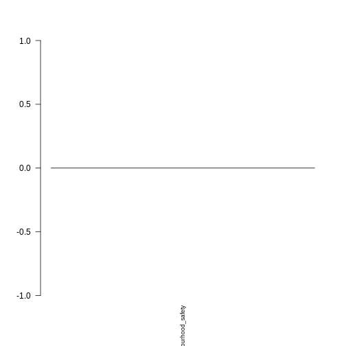
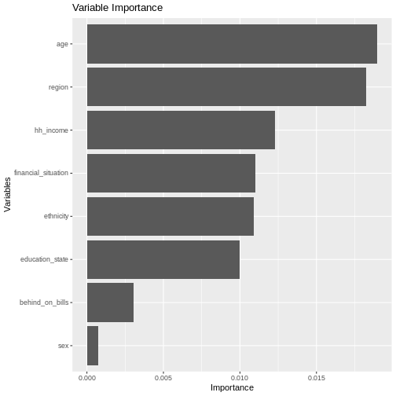
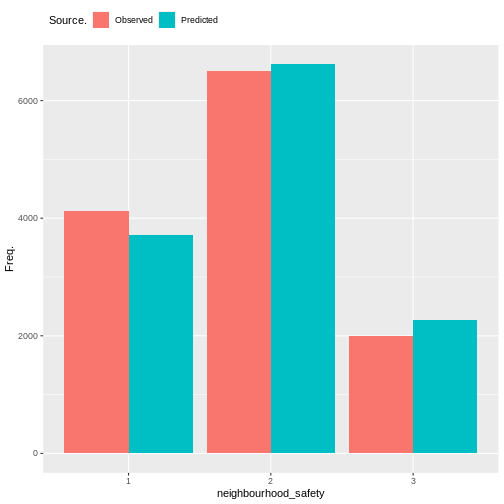

Neighbourhood
-------------

Neighbourhood Safety is a composite derived from 7 questions related to
different facets of safety in the neighbourhood.

They are:

-  burglaries
   (`crburg <https://www.understandingsociety.ac.uk/documentation/mainstage/variables/crburg/>`__)
-  car crime
   (`crcar <https://www.understandingsociety.ac.uk/documentation/mainstage/variables/crcar/>`__)
-  drunks
   (`crdrnk <https://www.understandingsociety.ac.uk/documentation/mainstage/variables/crdrnk/>`__)
-  muggings
   (`crmugg <https://www.understandingsociety.ac.uk/documentation/mainstage/variables/crmugg/>`__)
-  racial abuse
   (`crrace <https://www.understandingsociety.ac.uk/documentation/mainstage/variables/crrace/>`__)
-  teenager issues
   (`crteen <https://www.understandingsociety.ac.uk/documentation/mainstage/variables/crteen/>`__)
-  vandalism issues
   (`crvand <https://www.understandingsociety.ac.uk/documentation/mainstage/variables/crvand/>`__)

Each respondent is asked if they are concerned with these issues in
their neighbourhood, and response with 1 of:

1. Hardly ever
2. Some of the time
3. Often

We then assign people into three categories:

1. Very Safe Neighbourhood: Response to all crime questions is “not at
   all common”. Justification is that if you perceive no threat at all
   this is the best possible state.
2. Safe Neighbourhood: Responds to 1+ question as “not very common” but
   no responses to ‘fairly or very common’. Justification is that on the
   whole these people probably feel safe but not all is perfect, so
   probably not quite as desirable as group 1.
3. Unsafe Neighbourhood: Responds to 1+ question as fairly or very
   common’. Justification is that if perception of crime is very or
   fairly common, no matter what category, you are likely to feel that
   your neighbourhood safety is compromised.

Methods
~~~~~~~

   plot of chunk neighbourhood_barchart

Transition Model
~~~~~~~~~~~~~~~~

We fit a Random Forest Ordinal model from the
`ranger <https://www.rdocumentation.org/packages/ranger/versions/0.16.0>`__
package in R to estimate transitions for this variable.

Formula:

.. math::   neighbourhood\_safety \sim age + sex + ethnicity + region + education\_state + hh\_income + behind\_on\_bills + financial\_situation  

.. code:: r

   plot_rfo_importance(model)

   plot of chunk nh_safety_model_summary

Results
~~~~~~~

   plot of chunk neighbourhood_output

References
~~~~~~~~~~
