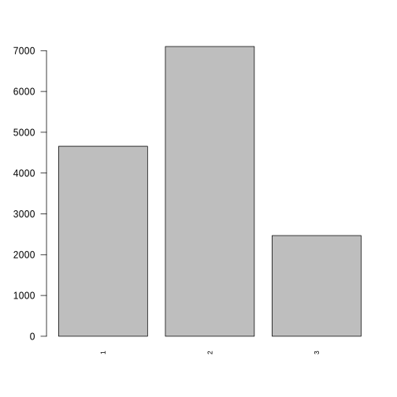

=============
Neighbourhood
=============

Neighbourhood
=============

Neighbourhood quality is an indicator of well-being suggested by the
SIPHER-7 XXXX ref and others?.

Methods
-------

::

   ## 
   ##     1     2     3 
   ##    43   690 26504

   plot of chunk neighbourhood_barchart

::

   ## [1] "/Users/robertclay/minos/docsrc/documentation/notebooks"

Neighbourhood data are presented as a likert scale from 1-6 indicating
the number of harmful activities that happen in a persons neighbourhood
for individual health. These include robberies and vandalism with the
full encoding available in the data tables.

Data
----

What variables are included? Why is this output chosen. What explanatory
variables are used and why are they chosen

Results
-------

What are the results. Coefficients tables. diagnostic plots. measures of
goodness of fit.

.. figure:: ./figure/housing_output-1.png
   :alt: plot of chunk housing_output

   plot of chunk housing_output

::

   ## formula: 
   ## neighbourhood_safety_next ~ factor(sex) + scale(age) + scale(SF_12) + factor(labour_state) + factor(ethnicity) + scale(hh_income) + factor(housing_quality) + factor(region) + factor(education_state)
   ## data:    data
   ## 
   ##  link  threshold nobs  logLik   AIC     niter max.grad cond.H 
   ##  logit flexible  22433 -2687.82 5463.63 8(0)  1.52e-10 2.0e+03
   ## 
   ## Coefficients:
   ##                                         Estimate Std. Error z value Pr(>|z|)    
   ## factor(sex)Male                        -0.031740   0.089168  -0.356 0.721873    
   ## scale(age)                             -0.254508   0.073601  -3.458 0.000544 ***
   ## scale(SF_12)                            0.091794   0.040158   2.286 0.022265 *  
   ## factor(labour_state)Family Care        -0.535625   0.203361  -2.634 0.008442 ** 
   ## factor(labour_state)Maternity Leave    -0.015578   0.723280  -0.022 0.982817    
   ## factor(labour_state)PT Employed        -0.205347   0.166713  -1.232 0.218048    
   ## factor(labour_state)Retired            -0.335930   0.158891  -2.114 0.034497 *  
   ## factor(labour_state)Self-employed       0.005913   0.191835   0.031 0.975409    
   ## factor(labour_state)Sick/Disabled      -1.070390   0.192336  -5.565 2.62e-08 ***
   ## factor(labour_state)Student            -1.115110   0.194842  -5.723 1.05e-08 ***
   ## factor(labour_state)Unemployed         -0.589783   0.201658  -2.925 0.003448 ** 
   ## factor(ethnicity)BLA                    0.022657   0.331144   0.068 0.945451    
   ## factor(ethnicity)BLC                   -0.141544   0.324078  -0.437 0.662286    
   ## factor(ethnicity)CHI                    0.294266   0.759214   0.388 0.698318    
   ## factor(ethnicity)IND                   -0.083718   0.297905  -0.281 0.778692    
   ## factor(ethnicity)MIX                   -0.505777   0.323286  -1.564 0.117703    
   ## factor(ethnicity)OAS                   -0.478387   0.346562  -1.380 0.167470    
   ## factor(ethnicity)OBL                   -0.267233   1.060968  -0.252 0.801136    
   ## factor(ethnicity)OTH                   -0.273907   0.646134  -0.424 0.671626    
   ## factor(ethnicity)PAK                    1.394876   0.475909   2.931 0.003379 ** 
   ## factor(ethnicity)WBI                   -0.102713   0.261599  -0.393 0.694588    
   ## factor(ethnicity)WHO                   -0.314102   0.311405  -1.009 0.313136    
   ## scale(hh_income)                        0.126070   0.119399   1.056 0.291027    
   ## factor(housing_quality)2                0.404822   0.184085   2.199 0.027871 *  
   ## factor(housing_quality)3                0.832864   0.202123   4.121 3.78e-05 ***
   ## factor(region)East of England           0.020601   0.257677   0.080 0.936278    
   ## factor(region)London                   -1.191791   0.215552  -5.529 3.22e-08 ***
   ## factor(region)North East               -0.423865   0.283933  -1.493 0.135480    
   ## factor(region)North West               -0.683882   0.221620  -3.086 0.002030 ** 
   ## factor(region)Northern Ireland          1.347346   0.489256   2.754 0.005890 ** 
   ## factor(region)Scotland                  0.074075   0.279820   0.265 0.791224    
   ## factor(region)South East               -0.646429   0.218717  -2.956 0.003121 ** 
   ## factor(region)South West               -0.148517   0.249938  -0.594 0.552370    
   ## factor(region)Wales                    -0.065368   0.299146  -0.219 0.827028    
   ## factor(region)West Midlands            -0.651428   0.229927  -2.833 0.004609 ** 
   ## factor(region)Yorkshire and The Humber  0.048596   0.259615   0.187 0.851516    
   ## factor(education_state)1               -0.165702   0.250210  -0.662 0.507811    
   ## factor(education_state)2                0.036101   0.119188   0.303 0.761974    
   ## factor(education_state)3                0.132924   0.164673   0.807 0.419551    
   ## factor(education_state)5                0.110116   0.174991   0.629 0.529177    
   ## factor(education_state)6                0.016460   0.139470   0.118 0.906051    
   ## factor(education_state)7                0.030088   0.163442   0.184 0.853943    
   ## ---
   ## Signif. codes:  0 '***' 0.001 '**' 0.01 '*' 0.05 '.' 0.1 ' ' 1
   ## 
   ## Threshold coefficients:
   ##     Estimate Std. Error z value
   ## 1|2  -6.9671     0.4248  -16.40
   ## 2|3  -3.9796     0.3870  -10.28

References
----------
