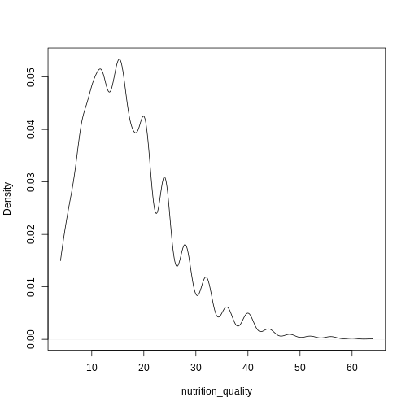
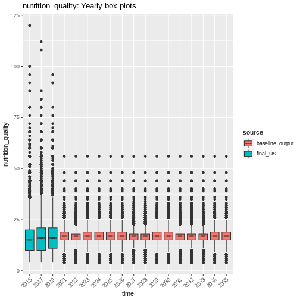
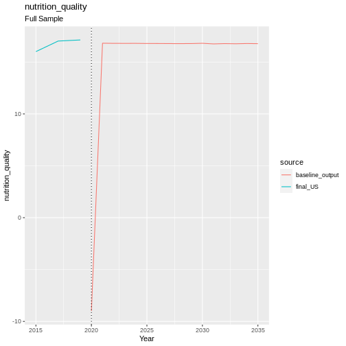
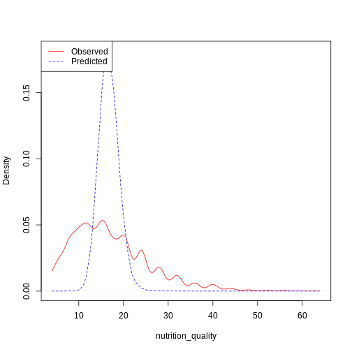
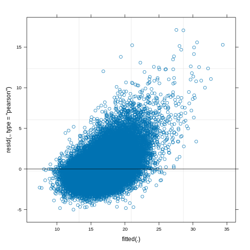

Nutrition
---------

Nutrition Quality is represented by a proxy of the number of portions of
fruit and vegetables eaten per week. The following variables from
understanding society that measure fruit and vegetable consumption were
used:

-  `wkfruit <https://www.understandingsociety.ac.uk/documentation/mainstage/dataset-documentation/variable/wkfruit>`__,
-  `fruitamt <https://www.understandingsociety.ac.uk/documentation/mainstage/dataset-documentation/variable/fruitamt>`__,
-  `wkvege <https://www.understandingsociety.ac.uk/documentation/mainstage/dataset-documentation/variable/wkvege>`__,
   and
-  `vegeamt <https://www.understandingsociety.ac.uk/documentation/mainstage/dataset-documentation/variable/vegeamt>`__.

The equations to generate the nutrition composite are as follows:

.. math::   fruit\_intermediate = days\_eating\_fruit\_per\_week * fruit\_per\_day  

.. math::   veg\_intermediate = days\_eating\_veg\_per\_week * veg\_per\_day  

.. math::   nutrition\_composite = fruit\_intermediate + veg\_intermediate 

Both
`fruit <https://www.understandingsociety.ac.uk/documentation/mainstage/dataset-documentation/variable/wkfruit>`__
and
`vegetable <https://www.understandingsociety.ac.uk/documentation/mainstage/dataset-documentation/variable/wkvege>`__
consumption frequency was measured in days per week, and reported as:

1. Never
2. 1-3 days
3. 4-6 days
4. Every day

The amount of
`fruit <https://www.understandingsociety.ac.uk/documentation/mainstage/dataset-documentation/variable/fruitamt>`__
and
`veg <https://www.understandingsociety.ac.uk/documentation/mainstage/dataset-documentation/variable/vegeamt>`__
per day was a continuous variable, indicating the number of portions of
fruit or veg eaten on an average day when the respondent eats fruit or
veg.

This gives us a continuous nutrition score, composed of the sum of two
proxy values for the amount of fruit and veg eaten per week.
Unfortunately because the ``days_eating_<>_per_week`` variables are
ordinal (levels = [Never, 1-3 days, 4-6 days, Everyday]) and not just
the number of days, we can’t calculate an actual value for
``amount_per_week``.

.. code:: r

   continuous_density(obs)

   plot of chunk nutrition_quality_data

Transition Model
~~~~~~~~~~~~~~~~

We use a Linear Mixed Model (LMM) from the
`lme4 <https://www.rdocumentation.org/packages/lme4/versions/1.1-36>`__
package in R to predict the next state of nutrition quality.

Formula:

.. math::   nutrition\_quality \sim age + sex + ethnicity + region + education\_state + hh\_income + \\behind\_on\_bills + financial\_situation + (1|pidp) + (1|hidp)  

.. code:: r

   print(summary(model))

::

   ## Linear mixed model fit by REML ['lmerMod']
   ## Formula: 
   ## nutrition_quality_new ~ scale(age) + factor(sex) + relevel(factor(ethnicity),  
   ##     ref = "WBI") + factor(region) + relevel(factor(education_state),  
   ##     ref = "1") + scale(hh_income) + factor(behind_on_bills) +  
   ##     factor(financial_situation) + (1 | pidp) + (1 | hidp)
   ##    Data: data
   ## Weights: weight
   ## 
   ## REML criterion at convergence: Inf
   ## 
   ## Scaled residuals: 
   ##     Min      1Q  Median      3Q     Max 
   ## -3.0255 -0.5686 -0.1083  0.4030 10.3602 
   ## 
   ## Random effects:
   ##  Groups   Name        Variance Std.Dev.
   ##  hidp     (Intercept) 2.73     1.652   
   ##  pidp     (Intercept) 2.73     1.652   
   ##  Residual             2.73     1.652   
   ## Number of obs: 71054, groups:  hidp, 50106; pidp, 29363
   ## 
   ## Fixed effects:
   ##                                                Estimate Std. Error t value
   ## (Intercept)                                  16.7777764  0.2699381  62.154
   ## scale(age)                                    0.6060477  0.0360846  16.795
   ## factor(sex)Male                              -1.3954227  0.0648867 -21.506
   ## relevel(factor(ethnicity), ref = "WBI")BAN   -1.4565355  0.4427054  -3.290
   ## relevel(factor(ethnicity), ref = "WBI")BLA   -0.6508614  0.2919993  -2.229
   ## relevel(factor(ethnicity), ref = "WBI")BLC   -0.9301406  0.3661440  -2.540
   ## relevel(factor(ethnicity), ref = "WBI")CHI    0.3147231  0.4786396   0.658
   ## relevel(factor(ethnicity), ref = "WBI")IND   -0.8920800  0.2145810  -4.157
   ## relevel(factor(ethnicity), ref = "WBI")MIX   -0.1020393  0.2725847  -0.374
   ## relevel(factor(ethnicity), ref = "WBI")OAS    0.7394536  0.3105643   2.381
   ## relevel(factor(ethnicity), ref = "WBI")OBL    0.7382279  0.9522457   0.775
   ## relevel(factor(ethnicity), ref = "WBI")OTH    0.5721686  0.4993300   1.146
   ## relevel(factor(ethnicity), ref = "WBI")PAK   -2.1172783  0.2658275  -7.965
   ## relevel(factor(ethnicity), ref = "WBI")WHO    1.5266685  0.1610739   9.478
   ## factor(region)East of England                 0.0004248  0.1552909   0.003
   ## factor(region)London                          0.0234354  0.1582542   0.148
   ## factor(region)North East                     -0.2600967  0.1983900  -1.311
   ## factor(region)North West                     -0.5042112  0.1542288  -3.269
   ## factor(region)Northern Ireland               -1.8388319  0.2308531  -7.965
   ## factor(region)Scotland                       -0.7264878  0.1729765  -4.200
   ## factor(region)South East                      0.2295814  0.1455389   1.577
   ## factor(region)South West                      0.4284066  0.1589688   2.695
   ## factor(region)Wales                           0.6864629  0.2073224   3.311
   ## factor(region)West Midlands                  -0.0495381  0.1606992  -0.308
   ## factor(region)Yorkshire and The Humber       -0.5631054  0.1601854  -3.515
   ## relevel(factor(education_state), ref = "1")0 -0.1515439  0.2474512  -0.612
   ## relevel(factor(education_state), ref = "1")2  0.3986112  0.2463440   1.618
   ## relevel(factor(education_state), ref = "1")3  0.9978339  0.2574642   3.876
   ## relevel(factor(education_state), ref = "1")5  1.2248215  0.2598521   4.714
   ## relevel(factor(education_state), ref = "1")6  2.3544895  0.2489350   9.458
   ## relevel(factor(education_state), ref = "1")7  2.8269895  0.2544413  11.111
   ## scale(hh_income)                              0.3559428  0.0332048  10.720
   ## factor(behind_on_bills)2                     -1.2496936  0.1726441  -7.239
   ## factor(behind_on_bills)3                     -2.3421004  0.6048798  -3.872
   ## factor(financial_situation)2                 -0.4663225  0.0754836  -6.178
   ## factor(financial_situation)3                 -0.9698255  0.0957914 -10.124
   ## factor(financial_situation)4                 -0.9704728  0.1660731  -5.844
   ## factor(financial_situation)5                 -1.4928310  0.2674788  -5.581

::

   ## 
   ## Correlation matrix not shown by default, as p = 38 > 12.
   ## Use print(summary(model), correlation=TRUE)  or
   ##     vcov(summary(model))        if you need it

::

   ## optimizer (nloptwrap) convergence code: 0 (OK)
   ## Gradient contains NAs

Validation
~~~~~~~~~~

.. code:: r

   handover_boxplots(raw.dat, base.dat, v)

   plot of chunk nutrition_validation

.. code:: r

   handover_lineplots(raw.dat, base.dat, v)

   plot of chunk nutrition_validation

Results
~~~~~~~

|plot of chunk nutrition_output|\ |image1|

References
~~~~~~~~~~

