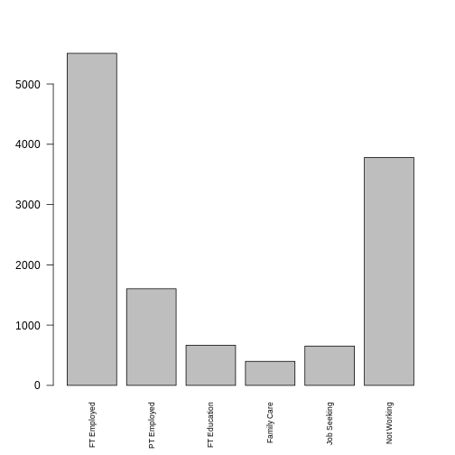
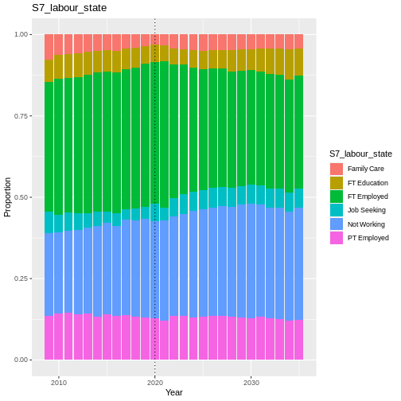
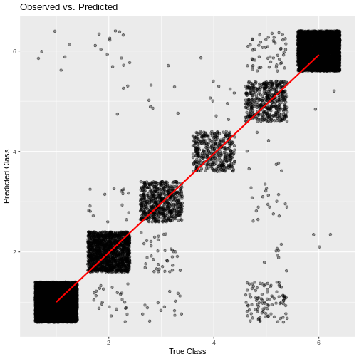
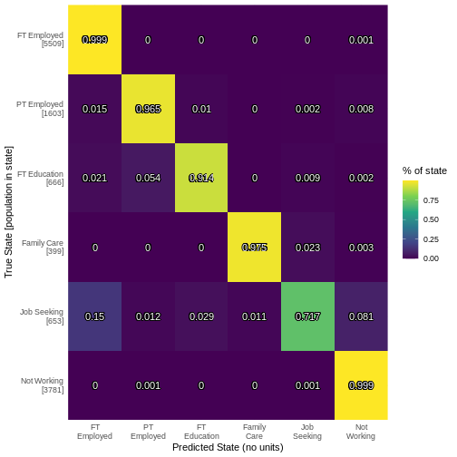

Labour
------

Labour state relates to the employment status of an individual, which is
derived from the
`jbstat <https://www.understandingsociety.ac.uk/documentation/mainstage/variables/jbstat/>`__
and
`jbft_dv <https://www.understandingsociety.ac.uk/documentation/mainstage/variables/jbft_dv/>`__
variables from Understanding Society. The jbstat variable from US has 16
categories, which we have recoded into a variable with 6 categories
based on the SIPHER 7 definition of labour state. jbft_dv indicates
whether the individual worked full or part time (greater than 30 hours
per week for full time). The table below shows which categories have
been combined into the new reduced categories:

+--------------------------------+-------------------------------------+
| New Category                   | Old Categories                      |
+================================+=====================================+
| FT Employed                    | Paid employment (AND jbft_dv == 1); |
|                                | Self-employed; Unpaid, family       |
|                                | business; Apprenticeship; Furlough  |
+--------------------------------+-------------------------------------+
| PT Employed                    | Paid employment (AND jbft_dv == 2)  |
+--------------------------------+-------------------------------------+
| Job Seeking                    | Unemployed; Temporarily laid        |
|                                | off/Short-term Working              |
+--------------------------------+-------------------------------------+
| FT Education                   | Full-time Student; Government       |
|                                | Training                            |
+--------------------------------+-------------------------------------+
| Family Care                    | Family Care                         |
+--------------------------------+-------------------------------------+
| Not Working                    | Retired; Maternity Leave; LT Sick   |
|                                | or Disabled                         |
+--------------------------------+-------------------------------------+

   plot of chunk labour_barchart

Transition Model
~~~~~~~~~~~~~~~~

Labour state is a complex categorical data type. Single layer neural
network is a simple way to estimate this state. Use multinom function
from R’s
`nnet <https://www.rdocumentation.org/packages/nnet/versions/7.3-20>`__
package. Formula for weights included given as.

.. math::   labour\_state \sim labour\_state_\_last + age + sex + ethnicity + region + education\_state + SF\_12 + hh\_income  

Validation
~~~~~~~~~~

.. code:: r

   handover_ordinal(raw.dat, base.dat, v)

   plot of chunk S7_labour_state_validation

Results
~~~~~~~

-  hard to determine goodness of fit.
-  use confusion matrix to estimate quality of fit.
-  employed/retired well predicted. unemployed/student volatile socially
   and expectedly hard to predict.
-  some deterministic replacement needed for categories like student
   that have specific time frames. e.g. three years for a degree.

|plot of chunk labour_output|\ |image1|

.. code:: r

   cumulative_link_plot(obs, preds)

::

   ## `geom_smooth()` using formula = 'y ~ x'

   plot of chunk labour_performance

References
~~~~~~~~~~

.. |plot of chunk labour_output| image:: ./figure/labour_output-1.png

