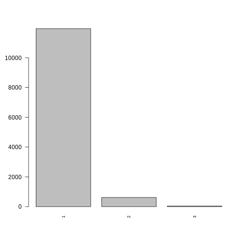
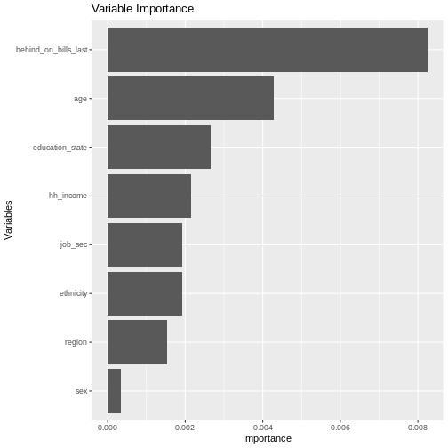
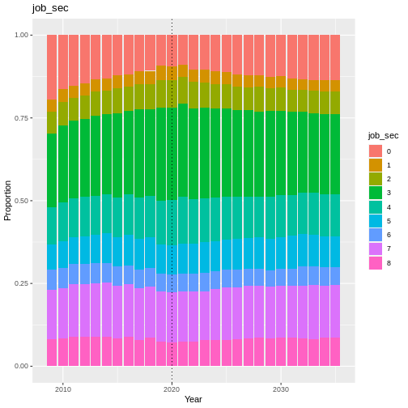
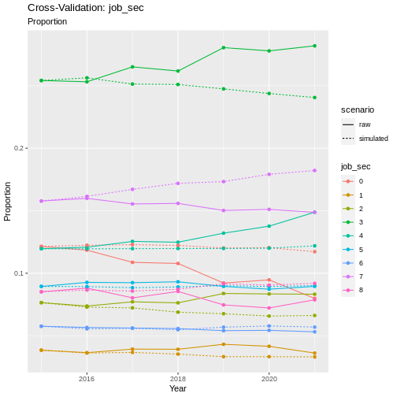
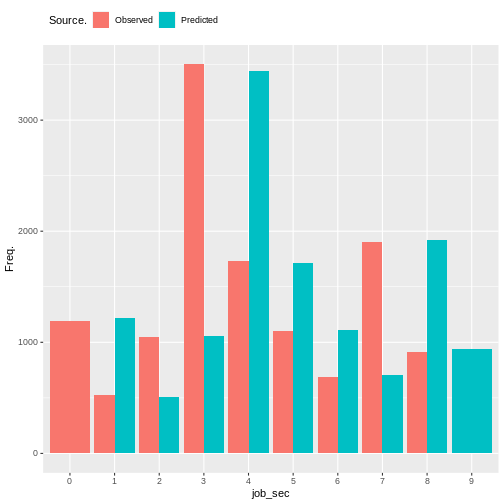
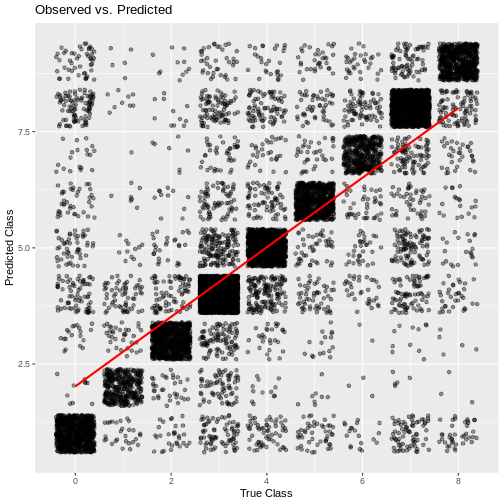

Behind on Bills
---------------

Behind on bills is a supplementary module in Minos. It is based on the
`xphsdba <https://www.understandingsociety.ac.uk/documentation/mainstage/variables/xphsdba/>`__
variable from Understanding Society, which represents an individuals
ability to pay their bills on time. The individual can then respond to
say that they are up to date with all bills (1), behind with some bills
(2), or behind with all bills (3).

.. code:: r

   #discrete_barplot(obs, 'loneliness')
   order <- c(1, 2, 3)
   discrete_barplot(obs, order)

   plot of chunk bob_data

Transition Model
~~~~~~~~~~~~~~~~

To predict the next state of behind_on_bills we use a Random Forest
Ordinal model from the
`ranger <https://www.rdocumentation.org/packages/ranger/versions/0.16.0>`__
package in R.

Formula:

.. math::   behind\_on\_bills \sim behind\_on\_bills\_last + age + sex + ethnicity + region + education\_state\\ + hh\_income + job\_sec  

.. code:: r

   plot_rfo_importance(model)

   plot of chunk bob_model_summary

Validation
~~~~~~~~~~

.. code:: r

   handover_ordinal(raw.dat, base.dat, v)

   plot of chunk bob_validation

.. code:: r

   pivoted <- combine_and_pivot_long(df1 = cv, 
                                          df1.name = 'simulated', 
                                          df2 = raw, 
                                          df2.name = 'raw', 
                                          var = v)

   cv_ordinal_plots(pivoted.df = pivoted, 
                    var = v,
                    save = FALSE)

::

   ## `summarise()` has grouped output by 'time', 'scenario'. You can override using
   ## the `.groups` argument.

   plot of chunk bob_cv

Results
~~~~~~~

Random Forest Ordinal models from the ranger package cannot provide a
summary like some other models can, so instead we will look at plots of
observed vs predicted values as well as the importance of each variable
in the resulting model.

   plot of chunk bob_output

.. code:: r

   cumulative_link_plot(obs, preds)

::

   ## `geom_smooth()` using formula = 'y ~ x'

   plot of chunk bob_performance
