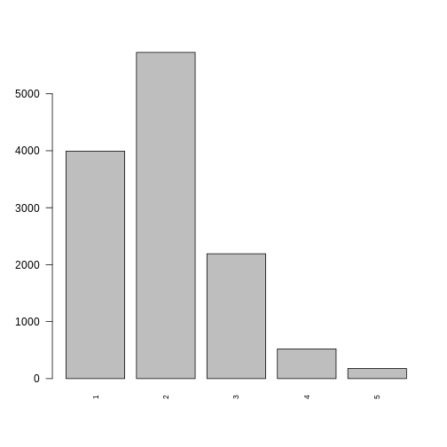
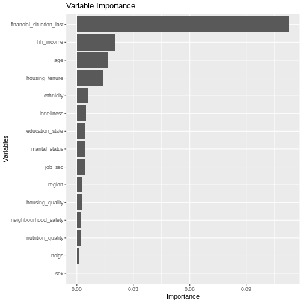
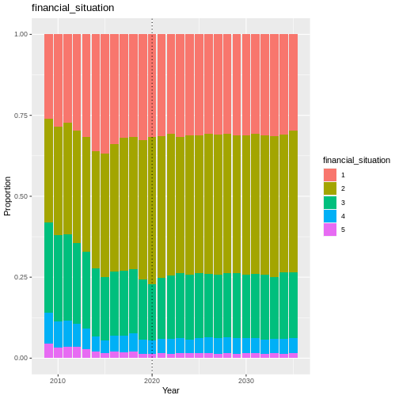
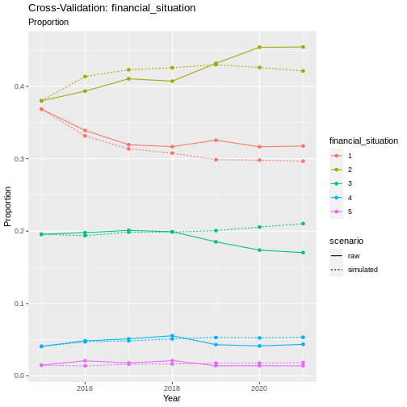
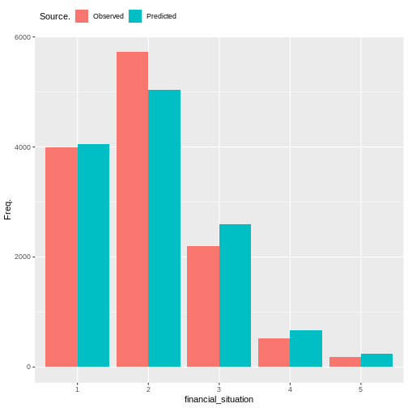
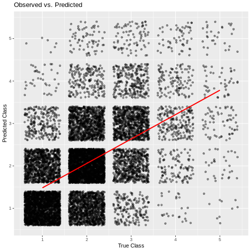

Financial Situation
-------------------

Financial Situation is a supplementary module in Minos. It is based on
the
`finnow <https://www.understandingsociety.ac.uk/documentation/mainstage/variables/finnow/>`__
variable from Understanding Society, which represents an individuals
current subjective financial situation. There are 5 levels of response;
Living comfortably (1), Doing alright (2), Just about getting by (3),
Finding it quite difficult (4), Finding it very difficult (5).

.. code:: r

   #discrete_barplot(obs, 'loneliness')
   order <- c(1, 2, 3, 4, 5)
   discrete_barplot(obs, order)

   plot of chunk fsitch_data

Transition Model
~~~~~~~~~~~~~~~~

To predict the next state of financial_situation we use a Random Forest
Ordinal model from the
`ranger <https://www.rdocumentation.org/packages/ranger/versions/0.16.0>`__
package in R.

Formula:

.. math::   financial\_situation \sim financial\_situation_last + age + sex + ethnicity + region\\ + education\_state + housing\_quality + neighbourhood\_safety\\ + loneliness + nutrition\_quality + ncigs + job\_sec\\ + hh\_income + marital\_status + housing\_tenure  

.. code:: r

   plot_rfo_importance(model)

   plot of chunk fsitch_model_summary

Validation
~~~~~~~~~~

.. code:: r

   handover_ordinal(raw.dat, base.dat, v)

   plot of chunk fsitch_validation

.. code:: r

   pivoted <- combine_and_pivot_long(df1 = cv, 
                                          df1.name = 'simulated', 
                                          df2 = raw, 
                                          df2.name = 'raw', 
                                          var = v)

   cv_ordinal_plots(pivoted.df = pivoted, 
                    var = v,
                    save = FALSE)

::

   ## `summarise()` has grouped output by 'time', 'scenario'. You can override using
   ## the `.groups` argument.

   plot of chunk fsitch_cv

Results
~~~~~~~

Random Forest Ordinal models from the ranger package cannot provide a
summary like some other models can, so instead we will look at plots of
observed vs predicted values as well as the importance of each variable
in the resulting model.

   plot of chunk fsitch_output

.. code:: r

   cumulative_link_plot(obs, preds)

::

   ## `geom_smooth()` using formula = 'y ~ x'

   plot of chunk fsitch_performance
