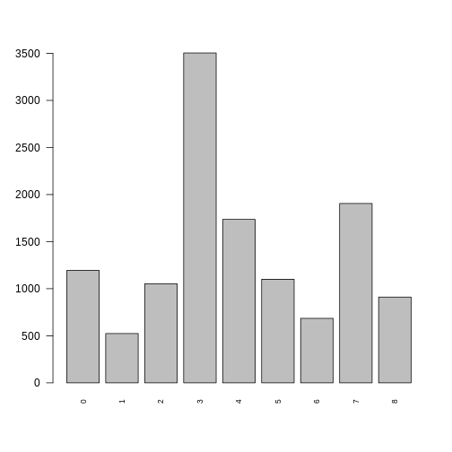
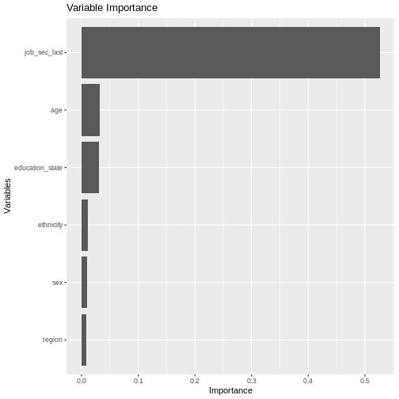

Job NSSEC
---------

Job NSSEC (known as job_sec in the model) refers to the eight category
version of the National Statistics Socio-economic Classification
(NS-SEC), and is taken directly from the
`jbnssec8_dv <https://www.understandingsociety.ac.uk/documentation/mainstage/variables/jbnssec8_dv/>`__
variable. See the table below for the categories and their value label:

===================================== ===========
Category                              Value Label
===================================== ===========
Large employers and higher management 1
Higher professional                   2
Lower management and professional     3
Intermediate                          4
Small employers and own account       5
Lower supervisory and technical       6
Semi-routine                          7
Routine                               8
Not Employed                          0
===================================== ===========

*NOTE*: Not Employed is a required category that is not part of the
original variable (jbnssec8_dv). An unemployed person would have a
missing value for job nssec and so has to be explicitly given one.

   plot of chunk job_sec_barchart

Transition Model
~~~~~~~~~~~~~~~~

To predict the next state of job_sec we use a Random Forest Ordinal
model from the
`ranger <https://www.rdocumentation.org/packages/ranger/versions/0.16.0>`__
package in R.

Formula:

.. math::   job\_sec \sim job\_sec\_last + age + sex + ethnicity + region + education\_state  

.. code:: r

   plot_rfo_importance(model)

   plot of chunk job_sec_summary

Validation
~~~~~~~~~~

.. code:: r

   handover_ordinal(raw.dat, base.dat, v)

.. figure:: ./figure/bob_validation-1.png
   :alt: plot of chunk bob_validation

   plot of chunk bob_validation

.. code:: r

   pivoted <- combine_and_pivot_long(df1 = cv, 
                                          df1.name = 'simulated', 
                                          df2 = raw, 
                                          df2.name = 'raw', 
                                          var = v)

   cv_ordinal_plots(pivoted.df = pivoted, 
                    var = v,
                    save = FALSE)

::

   ## `summarise()` has grouped output by 'time', 'scenario'. You can override using
   ## the `.groups` argument.

.. figure:: ./figure/bob_cv-1.png
   :alt: plot of chunk bob_cv

   plot of chunk bob_cv

Results
~~~~~~~

Random Forest Ordinal models from the ranger package cannot provide a
summary like some other models can, so instead we will look at plots of
observed vs predicted values as well as the importance of each variable
in the resulting model.

.. figure:: ./figure/bob_output-1.png
   :alt: plot of chunk bob_output

   plot of chunk bob_output

.. code:: r

   cumulative_link_plot(obs, preds)

::

   ## `geom_smooth()` using formula = 'y ~ x'

.. figure:: ./figure/bob_performance-1.png
   :alt: plot of chunk bob_performance

   plot of chunk bob_performance

References
~~~~~~~~~~
