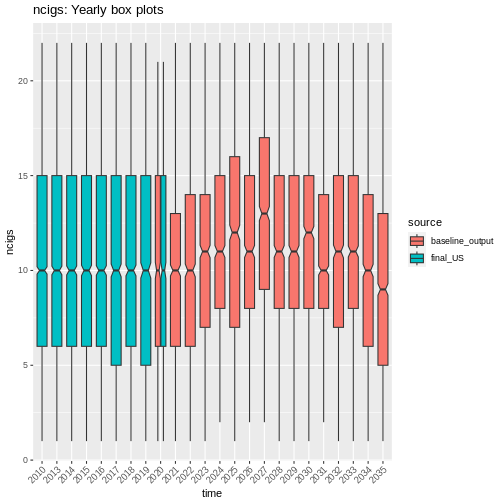
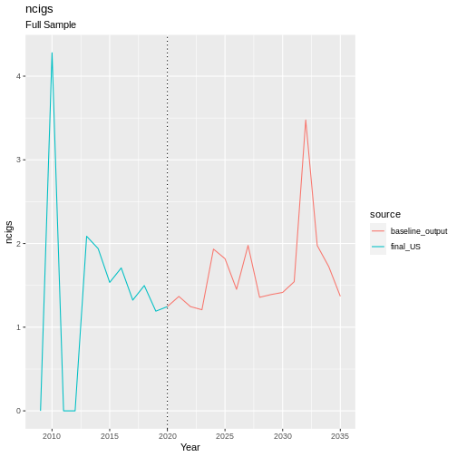
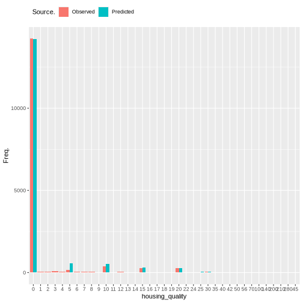

Tobacco
-------

Tobacco consumption is measured in the usual number of cigarettes smoked
per day, and is taken directly from a US variable
(`ncigs <https://www.understandingsociety.ac.uk/documentation/mainstage/dataset-documentation/variable/ncigs>`__).
Number of cigarettes consumed is an indicator of several mental
illnesses including anxiety (Lawrence et al. 2010).

.. code:: r

   continuous_density(obs)

.. figure:: ./figure/tobacco_data-1.png
   :alt: plot of chunk tobacco_data

   plot of chunk tobacco_data

.. code:: r

   obs_no_zero <- obs[obs != 0]  # remove zero values to look at counts only for smokers
   continuous_density(obs_no_zero)

.. figure:: ./figure/tobacco_data-2.png
   :alt: plot of chunk tobacco_data

   plot of chunk tobacco_data

Transition Model
~~~~~~~~~~~~~~~~

The number of zero inflated values is higher than expected for a count
distribution such as a poisson distribution. This inflation occurs
naturally as a large proportion (over 50%) of the population do not
smoke. There are two sources of cigarette consumption that can be
modelled using zero inflated models. In this case a zero-inflated
poisson (ZIP) is used. Two models are fitted simultaneously. One is a
logistic regression that estimates whether a person smokes cigarettes or
not. This provides a simple probability of smoking or not. The second is
a poisson counts model estimating the number of cigarettes consumed.
This is modelled using the ``zeroinfl()`` function from the
`pscl <https://www.rdocumentation.org/packages/pscl/versions/1.5.9>`__
package in R.

Formula:

.. math::   ncigs \sim ncigs\_last + age + sex + ethnicity + region + education\_state + housing\_quality + \\neighbourhood\_safety + loneliness + nutrition\_quality + \\hh\_income + SF\_12 + behind\_on\_bills + financial\_situation \\|\\ ncigs\_last + I(ncigs_last>0) + ethnicity + housing\_quality + \\neighbourhood\_safety + loneliness + nutrition\_quality + job\_sec + \\hh\_income + SF\_12 + behind\_on\_bills + financial\_situation  

NOTE: The syntax seen above ``I(ncigs>0)`` represents a binary flag for
whether a person smoked previously (``ncigs > 0``).

Two set of variables are needed for the logistic and poisson parts of
the ZIP model respectively. These two formula are separated by a ‘\|’
symbol. On the right hand side of the ‘\|’ is the formula for the
logistic regression that determines whether an individual is a smoker or
not. On the left side is the formula for the poisson model to predict
the counts of cigarettes for smokers.

ncigs_last previous number consumed. age. persons age. generally older
people and very young smoke. sex. ethnicity. certain ethnicities more
likely to smoke cigarettes. region. education_state. highest
qualification. housing quality. neighbourhood safety. loneliness.
nutrition quality. hh_income household income SF_12. wellbeing estimates
number of cigarettes smoked. behind on bills. financial situation.
labour_state. whether a person is employed or not. job_sec job quality

.. code:: r

   zip_output(model)

::

   ## 
   ## Call:
   ## zeroinfl(formula = formula, data = data, weights = weight, dist = "pois", 
   ##     link = "logit")
   ## 
   ## Pearson residuals:
   ##      Min       1Q   Median       3Q      Max 
   ## -1.39165 -0.02575 -0.01822 -0.01256  7.88394 
   ## 
   ## Count model coefficients (poisson with log link):
   ##                                               Estimate Std. Error z value
   ## (Intercept)                                   1.756078   0.515096   3.409
   ## scale(age)                                    0.088226   0.072250   1.221
   ## factor(sex)Male                               0.132957   0.100926   1.317
   ## relevel(factor(ethnicity), ref = "WBI")BAN   -0.458047   0.724719  -0.632
   ## relevel(factor(ethnicity), ref = "WBI")BLA   -0.324150   0.524756  -0.618
   ## relevel(factor(ethnicity), ref = "WBI")BLC   -0.395408   0.500650  -0.790
   ## relevel(factor(ethnicity), ref = "WBI")CHI   -0.202406   1.083906  -0.187
   ## relevel(factor(ethnicity), ref = "WBI")IND   -0.222598   0.469511  -0.474
   ## relevel(factor(ethnicity), ref = "WBI")MIX   -0.343940   0.325918  -1.055
   ## relevel(factor(ethnicity), ref = "WBI")OAS   -0.604959   1.098497  -0.551
   ## relevel(factor(ethnicity), ref = "WBI")OBL   -0.423129   1.781472  -0.238
   ## relevel(factor(ethnicity), ref = "WBI")OTH    0.168325   0.534438   0.315
   ## relevel(factor(ethnicity), ref = "WBI")PAK   -0.852220   0.645376  -1.321
   ## relevel(factor(ethnicity), ref = "WBI")WHO    0.129127   0.178164   0.725
   ## factor(region)East of England                -0.207061   0.220486  -0.939
   ## factor(region)London                         -0.195256   0.224629  -0.869
   ## factor(region)North East                     -0.117416   0.263432  -0.446
   ## factor(region)North West                     -0.043274   0.201905  -0.214
   ## factor(region)Northern Ireland                0.013488   0.398038   0.034
   ## factor(region)Scotland                       -0.179701   0.257042  -0.699
   ## factor(region)South East                     -0.039395   0.207855  -0.190
   ## factor(region)South West                     -0.235811   0.227424  -1.037
   ## factor(region)Wales                          -0.045986   0.260487  -0.177
   ## factor(region)West Midlands                   0.122812   0.198825   0.618
   ## factor(region)Yorkshire and The Humber       -0.004834   0.211307  -0.023
   ## relevel(factor(education_state), ref = "1")0  0.422996   0.443084   0.955
   ## relevel(factor(education_state), ref = "1")2  0.362267   0.443040   0.818
   ## relevel(factor(education_state), ref = "1")3  0.157176   0.459963   0.342
   ## relevel(factor(education_state), ref = "1")5  0.199678   0.467004   0.428
   ## relevel(factor(education_state), ref = "1")6  0.103512   0.466882   0.222
   ## relevel(factor(education_state), ref = "1")7  0.497267   0.464812   1.070
   ## factor(housing_quality)Low                   -0.056672   0.175289  -0.323
   ## factor(housing_quality)Medium                -0.025581   0.117700  -0.217
   ## factor(loneliness)2                           0.164228   0.110798   1.482
   ## factor(loneliness)3                          -0.088262   0.187043  -0.472
   ## scale(nutrition_quality)                     -0.086828   0.057143  -1.519
   ## scale(ncigs)                                  0.060370   0.011383   5.303
   ## scale(hh_income)                             -0.047014   0.072999  -0.644
   ## scale(SF_12)                                 -0.042692   0.052335  -0.816
   ## factor(behind_on_bills)2                      0.032621   0.140519   0.232
   ## factor(behind_on_bills)3                     -0.223792   0.591207  -0.379
   ## factor(financial_situation)2                  0.132737   0.145536   0.912
   ## factor(financial_situation)3                  0.014451   0.167452   0.086
   ## factor(financial_situation)4                  0.047932   0.214865   0.223
   ## factor(financial_situation)5                 -0.059367   0.284620  -0.209
   ## factor(S7_labour_state)PT Employed           -0.012102   0.159718  -0.076
   ## factor(S7_labour_state)Job Seeking            0.137922   0.175851   0.784
   ## factor(S7_labour_state)FT Education          -0.389807   0.402215  -0.969
   ## factor(S7_labour_state)Family Care            0.172396   0.246076   0.701
   ## factor(S7_labour_state)Not Working            0.053776   0.146154   0.368
   ## factor(job_sec)1                              0.148942   0.307434   0.484
   ## factor(job_sec)2                             -0.006665   0.337203  -0.020
   ## factor(job_sec)3                              0.168864   0.214513   0.787
   ## factor(job_sec)4                              0.168856   0.225449   0.749
   ## factor(job_sec)5                              0.123171   0.230018   0.535
   ## factor(job_sec)6                              0.225291   0.225344   1.000
   ## factor(job_sec)7                              0.112134   0.208409   0.538
   ## factor(job_sec)8                              0.244970   0.226591   1.081
   ##                                              Pr(>|z|)    
   ## (Intercept)                                  0.000651 ***
   ## scale(age)                                   0.222038    
   ## factor(sex)Male                              0.187716    
   ## relevel(factor(ethnicity), ref = "WBI")BAN   0.527365    
   ## relevel(factor(ethnicity), ref = "WBI")BLA   0.536762    
   ## relevel(factor(ethnicity), ref = "WBI")BLC   0.429651    
   ## relevel(factor(ethnicity), ref = "WBI")CHI   0.851866    
   ## relevel(factor(ethnicity), ref = "WBI")IND   0.635425    
   ## relevel(factor(ethnicity), ref = "WBI")MIX   0.291290    
   ## relevel(factor(ethnicity), ref = "WBI")OAS   0.581829    
   ## relevel(factor(ethnicity), ref = "WBI")OBL   0.812256    
   ## relevel(factor(ethnicity), ref = "WBI")OTH   0.752794    
   ## relevel(factor(ethnicity), ref = "WBI")PAK   0.186668    
   ## relevel(factor(ethnicity), ref = "WBI")WHO   0.468595    
   ## factor(region)East of England                0.347674    
   ## factor(region)London                         0.384715    
   ## factor(region)North East                     0.655802    
   ## factor(region)North West                     0.830289    
   ## factor(region)Northern Ireland               0.972969    
   ## factor(region)Scotland                       0.484482    
   ## factor(region)South East                     0.849678    
   ## factor(region)South West                     0.299792    
   ## factor(region)Wales                          0.859872    
   ## factor(region)West Midlands                  0.536781    
   ## factor(region)Yorkshire and The Humber       0.981749    
   ## relevel(factor(education_state), ref = "1")0 0.339748    
   ## relevel(factor(education_state), ref = "1")2 0.413537    
   ## relevel(factor(education_state), ref = "1")3 0.732565    
   ## relevel(factor(education_state), ref = "1")5 0.668962    
   ## relevel(factor(education_state), ref = "1")6 0.824541    
   ## relevel(factor(education_state), ref = "1")7 0.284698    
   ## factor(housing_quality)Low                   0.746463    
   ## factor(housing_quality)Medium                0.827943    
   ## factor(loneliness)2                          0.138279    
   ## factor(loneliness)3                          0.637011    
   ## scale(nutrition_quality)                     0.128639    
   ## scale(ncigs)                                 1.14e-07 ***
   ## scale(hh_income)                             0.519552    
   ## scale(SF_12)                                 0.414641    
   ## factor(behind_on_bills)2                     0.816425    
   ## factor(behind_on_bills)3                     0.705034    
   ## factor(financial_situation)2                 0.361740    
   ## factor(financial_situation)3                 0.931227    
   ## factor(financial_situation)4                 0.823472    
   ## factor(financial_situation)5                 0.834774    
   ## factor(S7_labour_state)PT Employed           0.939602    
   ## factor(S7_labour_state)Job Seeking           0.432859    
   ## factor(S7_labour_state)FT Education          0.332469    
   ## factor(S7_labour_state)Family Care           0.483564    
   ## factor(S7_labour_state)Not Working           0.712916    
   ## factor(job_sec)1                             0.628053    
   ## factor(job_sec)2                             0.984231    
   ## factor(job_sec)3                             0.431166    
   ## factor(job_sec)4                             0.453871    
   ## factor(job_sec)5                             0.592314    
   ## factor(job_sec)6                             0.317424    
   ## factor(job_sec)7                             0.590546    
   ## factor(job_sec)8                             0.279648    
   ## 
   ## Zero-inflation model coefficients (binomial with logit link):
   ##                                            Estimate Std. Error z value Pr(>|z|)
   ## (Intercept)                                 5.32237    1.07790   4.938 7.90e-07
   ## I(factor(ncigs > 0))TRUE                   -4.69548    0.93360  -5.029 4.92e-07
   ## relevel(factor(ethnicity), ref = "WBI")BAN -0.50680    3.28346  -0.154    0.877
   ## relevel(factor(ethnicity), ref = "WBI")BLA -0.09712    2.29730  -0.042    0.966
   ## relevel(factor(ethnicity), ref = "WBI")BLC -1.14543    2.34089  -0.489    0.625
   ## relevel(factor(ethnicity), ref = "WBI")CHI -0.89546    3.71259  -0.241    0.809
   ## relevel(factor(ethnicity), ref = "WBI")IND  0.14328    2.26575   0.063    0.950
   ## relevel(factor(ethnicity), ref = "WBI")MIX -0.08254    2.00374  -0.041    0.967
   ## relevel(factor(ethnicity), ref = "WBI")OAS  0.39417    3.41132   0.116    0.908
   ## relevel(factor(ethnicity), ref = "WBI")OBL -0.43468    8.72959  -0.050    0.960
   ## relevel(factor(ethnicity), ref = "WBI")OTH  1.73849    3.39195   0.513    0.608
   ## relevel(factor(ethnicity), ref = "WBI")PAK  0.96084    2.13239   0.451    0.652
   ## relevel(factor(ethnicity), ref = "WBI")WHO -0.43313    1.21204  -0.357    0.721
   ## factor(housing_quality)Low                 -0.57763    1.15367  -0.501    0.617
   ## factor(housing_quality)Medium              -0.52553    0.70965  -0.741    0.459
   ## factor(loneliness)2                        -0.14139    0.74225  -0.190    0.849
   ## factor(loneliness)3                         0.13103    1.20400   0.109    0.913
   ## scale(nutrition_quality)                    0.05535    0.33362   0.166    0.868
   ## scale(ncigs)                               -0.62567    0.39396  -1.588    0.112
   ## relevel(factor(job_sec), ref = "3")0        0.05608    1.33826   0.042    0.967
   ## relevel(factor(job_sec), ref = "3")1       -0.80761    1.65422  -0.488    0.625
   ## relevel(factor(job_sec), ref = "3")2        0.02727    1.36350   0.020    0.984
   ## relevel(factor(job_sec), ref = "3")4       -0.33529    1.02164  -0.328    0.743
   ## relevel(factor(job_sec), ref = "3")5       -0.35811    1.21971  -0.294    0.769
   ## relevel(factor(job_sec), ref = "3")6       -0.49222    1.38210  -0.356    0.722
   ## relevel(factor(job_sec), ref = "3")7       -0.61393    0.94742  -0.648    0.517
   ## relevel(factor(job_sec), ref = "3")8       -0.68657    1.19747  -0.573    0.566
   ## scale(hh_income)                            0.05335    0.40103   0.133    0.894
   ## scale(SF_12)                                0.07009    0.34707   0.202    0.840
   ## factor(behind_on_bills)2                   -1.16405    1.15193  -1.011    0.312
   ## factor(behind_on_bills)3                    0.40170    5.17767   0.078    0.938
   ## factor(financial_situation)2               -0.12475    0.82111  -0.152    0.879
   ## factor(financial_situation)3               -0.52030    0.97033  -0.536    0.592
   ## factor(financial_situation)4               -0.17864    1.40060  -0.128    0.899
   ## factor(financial_situation)5               -1.09378    2.30711  -0.474    0.635
   ##                                               
   ## (Intercept)                                ***
   ## I(factor(ncigs > 0))TRUE                   ***
   ## relevel(factor(ethnicity), ref = "WBI")BAN    
   ## relevel(factor(ethnicity), ref = "WBI")BLA    
   ## relevel(factor(ethnicity), ref = "WBI")BLC    
   ## relevel(factor(ethnicity), ref = "WBI")CHI    
   ## relevel(factor(ethnicity), ref = "WBI")IND    
   ## relevel(factor(ethnicity), ref = "WBI")MIX    
   ## relevel(factor(ethnicity), ref = "WBI")OAS    
   ## relevel(factor(ethnicity), ref = "WBI")OBL    
   ## relevel(factor(ethnicity), ref = "WBI")OTH    
   ## relevel(factor(ethnicity), ref = "WBI")PAK    
   ## relevel(factor(ethnicity), ref = "WBI")WHO    
   ## factor(housing_quality)Low                    
   ## factor(housing_quality)Medium                 
   ## factor(loneliness)2                           
   ## factor(loneliness)3                           
   ## scale(nutrition_quality)                      
   ## scale(ncigs)                                  
   ## relevel(factor(job_sec), ref = "3")0          
   ## relevel(factor(job_sec), ref = "3")1          
   ## relevel(factor(job_sec), ref = "3")2          
   ## relevel(factor(job_sec), ref = "3")4          
   ## relevel(factor(job_sec), ref = "3")5          
   ## relevel(factor(job_sec), ref = "3")6          
   ## relevel(factor(job_sec), ref = "3")7          
   ## relevel(factor(job_sec), ref = "3")8          
   ## scale(hh_income)                              
   ## scale(SF_12)                                  
   ## factor(behind_on_bills)2                      
   ## factor(behind_on_bills)3                      
   ## factor(financial_situation)2                  
   ## factor(financial_situation)3                  
   ## factor(financial_situation)4                  
   ## factor(financial_situation)5                  
   ## ---
   ## Signif. codes:  0 '***' 0.001 '**' 0.01 '*' 0.05 '.' 0.1 ' ' 1 
   ## 
   ## Number of iterations in BFGS optimization: 62 
   ## Log-likelihood: -225.5 on 93 Df

Validation
~~~~~~~~~~

.. code:: r

   handover_boxplots(raw.dat, base.dat, v)

   plot of chunk ncigs_validation

.. code:: r

   handover_lineplots(raw.dat, base.dat, v)

   plot of chunk ncigs_validation

Results
~~~~~~~

Almost all coefficients significant. Particularly previous consumption
of cigarettes. Good estimation of the number of non-smokers in the
population at around 55%. Counts of smoking are underdispersed and fail
to estimate consumption over 20 cigarettes.

::

   ## Error in density.default(obs, from = 0): argument 'x' must be numeric

   plot of chunk tobacco_output

References
~~~~~~~~~~

.. container:: references csl-bib-body hanging-indent
   :name: refs

   .. container:: csl-entry
      :name: ref-lawrence2010anxiety

      Lawrence, David, Julie Considine, Francis Mitrou, and Stephen R
      Zubrick. 2010. “Anxiety Disorders and Cigarette Smoking: Results
      from the Australian Survey of Mental Health and Wellbeing.”
      *Australian & New Zealand Journal of Psychiatry* 44 (6): 520–27.
