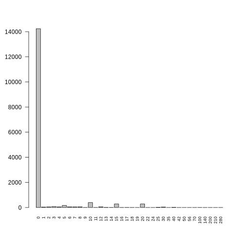
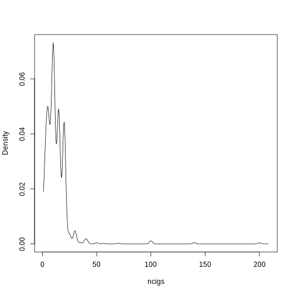

Tobacco
-------

Tobacco consumption is measured in the usual number of cigarettes smoked
per day, and is taken directly from a US variable
(`ncigs <https://www.understandingsociety.ac.uk/documentation/mainstage/dataset-documentation/variable/ncigs>`__).
Number of cigarettes consumed is an indicator of several mental
illnesses including anxiety (Lawrence et al. 2010).

.. code:: r

   continuous_density(obs)

   plot of chunk tobacco_data

.. code:: r

   obs_no_zero <- obs[obs != 0]  # remove zero values to look at counts only for smokers
   continuous_density(obs_no_zero)

   plot of chunk tobacco_data

Transition Model
~~~~~~~~~~~~~~~~

The number of zero inflated values is higher than expected for a count
distribution such as a poisson distribution. This inflation occurs
naturally as a large proportion (over 50%) of the population do not
smoke. There are two sources of cigarette consumption that can be
modelled using zero inflated models. In this case a zero-inflated
poisson (ZIP) is used. Two models are fitted simultaneously. One is a
logistic regression that estimates whether a person smokes cigarettes or
not. This provides a simple probability of smoking or not. The second is
a poisson counts model estimating the number of cigarettes consumed.
This is modelled using the ``zeroinfl()`` function from the
`pscl <https://www.rdocumentation.org/packages/pscl/versions/1.5.9>`__
package in R.

Formula:

.. math::   ncigs ~ ncigs\_last + age + sex + ethnicity + region + education\_state + housing\_quality + neighbourhood\_safety + loneliness + nutrition\_quality + hh\_income + SF\_12 + behind\_on\_bills + financial\_situation | ncigs\_last + I(ncigs_last>0) + ethnicity + housing\_quality + neighbourhood\_safety + loneliness + nutrition\_quality + job\_sec + hh\_income + SF\_12 + behind\_on\_bills + financial\_situation  

NOTE: The syntax seen above ``I(ncigs>0)`` represents a binary flag for
whether a person smoked previously (``ncigs > 0``).

Two set of variables are needed for the logistic and poisson parts of
the ZIP model respectively. These two formula are separated by a ‘\|’
symbol. On the right hand side of the ‘\|’ is the formula for the
logistic regression that determines whether an individual is a smoker or
not. On the left side is the formula for the poisson model to predict
the counts of cigarettes for smokers.

ncigs_last previous number consumed. age. persons age. generally older
people and very young smoke. sex. ethnicity. certain ethnicities more
likely to smoke cigarettes. region. education_state. highest
qualification. housing quality. neighbourhood safety. loneliness.
nutrition quality. hh_income household income SF_12. wellbeing estimates
number of cigarettes smoked. behind on bills. financial situation.
labour_state. whether a person is employed or not. job_sec job quality

Results
~~~~~~~

Almost all coefficients significant. Particularly prevous consumption of
cigarettes. Good estimation of the number of non-smokers in the
population at around 55%. Counts of smoking are underdispersed and fail
to estimate consumption over 20 cigarettes.

::

   ## 
   ## Call:
   ## zeroinfl(formula = formula, data = data, weights = weight, dist = "pois", link = "logit")
   ## 
   ## Pearson residuals:
   ##      Min       1Q   Median       3Q      Max 
   ## -1.45437 -0.02773 -0.01965 -0.01353  8.30856 
   ## 
   ## Count model coefficients (poisson with log link):
   ##                                              Estimate Std. Error z value Pr(>|z|)    
   ## (Intercept)                                   1.72409    0.49775   3.464 0.000533 ***
   ## scale(age)                                    0.09041    0.06859   1.318 0.187420    
   ## factor(sex)Male                               0.13067    0.09624   1.358 0.174529    
   ## relevel(factor(ethnicity), ref = "WBI")BAN   -0.44325    0.69279  -0.640 0.522298    
   ## relevel(factor(ethnicity), ref = "WBI")BLA   -0.31833    0.50089  -0.636 0.525075    
   ## relevel(factor(ethnicity), ref = "WBI")BLC   -0.38868    0.47962  -0.810 0.417711    
   ## relevel(factor(ethnicity), ref = "WBI")CHI   -0.22788    1.03680  -0.220 0.826036    
   ## relevel(factor(ethnicity), ref = "WBI")IND   -0.22728    0.44873  -0.507 0.612505    
   ## relevel(factor(ethnicity), ref = "WBI")MIX   -0.32788    0.30837  -1.063 0.287657    
   ## relevel(factor(ethnicity), ref = "WBI")OAS   -0.63268    1.04973  -0.603 0.546703    
   ## relevel(factor(ethnicity), ref = "WBI")OBL   -0.43609    1.70339  -0.256 0.797940    
   ## relevel(factor(ethnicity), ref = "WBI")OTH    0.20023    0.51079   0.392 0.695060    
   ## relevel(factor(ethnicity), ref = "WBI")PAK   -0.95661    0.61721  -1.550 0.121166    
   ## relevel(factor(ethnicity), ref = "WBI")WHO    0.14312    0.16578   0.863 0.387974    
   ## factor(region)East of England                -0.20573    0.21137  -0.973 0.330406    
   ## factor(region)London                         -0.17688    0.21452  -0.825 0.409635    
   ## factor(region)North East                     -0.12049    0.25095  -0.480 0.631129    
   ## factor(region)North West                     -0.05639    0.19284  -0.292 0.769969    
   ## factor(region)Northern Ireland                0.03263    0.38130   0.086 0.931794    
   ## factor(region)Scotland                       -0.18641    0.24536  -0.760 0.447391    
   ## factor(region)South East                     -0.02140    0.19699  -0.109 0.913507    
   ## factor(region)South West                     -0.22628    0.21760  -1.040 0.298390    
   ## factor(region)Wales                          -0.01677    0.24330  -0.069 0.945036    
   ## factor(region)West Midlands                   0.13519    0.19038   0.710 0.477630    
   ## factor(region)Yorkshire and The Humber       -0.02693    0.20145  -0.134 0.893671    
   ## relevel(factor(education_state), ref = "1")0  0.41572    0.42453   0.979 0.327458    
   ## relevel(factor(education_state), ref = "1")2  0.37624    0.42433   0.887 0.375261    
   ## relevel(factor(education_state), ref = "1")3  0.16851    0.44095   0.382 0.702354    
   ## relevel(factor(education_state), ref = "1")5  0.20783    0.44777   0.464 0.642537    
   ## relevel(factor(education_state), ref = "1")6  0.09134    0.44747   0.204 0.838255    
   ## relevel(factor(education_state), ref = "1")7  0.50451    0.44562   1.132 0.257572    
   ## factor(housing_quality)Medium                 0.04269    0.14236   0.300 0.764265    
   ## factor(housing_quality)High                   0.04043    0.16699   0.242 0.808679    
   ## factor(loneliness)2                           0.17604    0.10546   1.669 0.095058 .  
   ## factor(loneliness)3                          -0.08604    0.17808  -0.483 0.629000    
   ## scale(nutrition_quality)                     -0.08337    0.05447  -1.531 0.125875    
   ## scale(ncigs)                                  0.05974    0.01083   5.518 3.42e-08 ***
   ## scale(hh_income)                             -0.04463    0.06939  -0.643 0.520101    
   ## scale(SF_12)                                 -0.04430    0.05001  -0.886 0.375776    
   ## factor(behind_on_bills)2                      0.04322    0.13374   0.323 0.746547    
   ## factor(behind_on_bills)3                     -0.18571    0.56601  -0.328 0.742834    
   ## factor(financial_situation)2                  0.09675    0.13791   0.702 0.482934    
   ## factor(financial_situation)3                 -0.01376    0.15915  -0.086 0.931113    
   ## factor(financial_situation)4                  0.00965    0.20223   0.048 0.961942    
   ## factor(financial_situation)5                 -0.08773    0.26832  -0.327 0.743685    
   ## factor(S7_labour_state)PT Employed           -0.01681    0.15242  -0.110 0.912184    
   ## factor(S7_labour_state)Job Seeking            0.09018    0.16283   0.554 0.579696    
   ## factor(S7_labour_state)FT Education          -0.38950    0.38602  -1.009 0.312969    
   ## factor(S7_labour_state)Family Care            0.18031    0.23598   0.764 0.444812    
   ## factor(S7_labour_state)Not Working            0.05611    0.13918   0.403 0.686852    
   ## factor(job_sec)1                              0.14933    0.29515   0.506 0.612908    
   ## factor(job_sec)2                             -0.05472    0.32027  -0.171 0.864336    
   ## factor(job_sec)3                              0.14970    0.20356   0.735 0.462082    
   ## factor(job_sec)4                              0.15408    0.21457   0.718 0.472709    
   ## factor(job_sec)5                              0.11140    0.22067   0.505 0.613702    
   ## factor(job_sec)6                              0.23010    0.21368   1.077 0.281552    
   ## factor(job_sec)7                              0.10242    0.19933   0.514 0.607390    
   ## factor(job_sec)8                              0.23159    0.21683   1.068 0.285495    
   ## 
   ## Zero-inflation model coefficients (binomial with logit link):
   ##                                            Estimate Std. Error z value Pr(>|z|)    
   ## (Intercept)                                 4.71296    1.32867   3.547 0.000389 ***
   ## I(factor(ncigs > 0))TRUE                   -4.58239    0.88085  -5.202 1.97e-07 ***
   ## relevel(factor(ethnicity), ref = "WBI")BAN -0.49307    3.10022  -0.159 0.873634    
   ## relevel(factor(ethnicity), ref = "WBI")BLA -0.08268    2.17907  -0.038 0.969734    
   ## relevel(factor(ethnicity), ref = "WBI")BLC -1.09652    2.22716  -0.492 0.622481    
   ## relevel(factor(ethnicity), ref = "WBI")CHI -0.85080    3.53923  -0.240 0.810026    
   ## relevel(factor(ethnicity), ref = "WBI")IND  0.17305    2.15132   0.080 0.935888    
   ## relevel(factor(ethnicity), ref = "WBI")MIX -0.08094    1.89347  -0.043 0.965903    
   ## relevel(factor(ethnicity), ref = "WBI")OAS  0.37827    3.18435   0.119 0.905441    
   ## relevel(factor(ethnicity), ref = "WBI")OBL -0.41819    8.19974  -0.051 0.959325    
   ## relevel(factor(ethnicity), ref = "WBI")OTH  1.80957    3.25854   0.555 0.578668    
   ## relevel(factor(ethnicity), ref = "WBI")PAK  0.50144    2.02913   0.247 0.804815    
   ## relevel(factor(ethnicity), ref = "WBI")WHO -0.42438    1.14662  -0.370 0.711301    
   ## factor(housing_quality)Medium               0.05014    0.98424   0.051 0.959373    
   ## factor(housing_quality)High                 0.55011    1.08484   0.507 0.612094    
   ## factor(loneliness)2                        -0.20514    0.69973  -0.293 0.769399    
   ## factor(loneliness)3                         0.05857    1.13306   0.052 0.958773    
   ## scale(nutrition_quality)                    0.06449    0.31504   0.205 0.837815    
   ## scale(ncigs)                               -0.64162    0.37763  -1.699 0.089303 .  
   ## relevel(factor(job_sec), ref = "3")0        0.08153    1.26568   0.064 0.948641    
   ## relevel(factor(job_sec), ref = "3")1       -0.75924    1.56243  -0.486 0.627013    
   ## relevel(factor(job_sec), ref = "3")2       -0.05307    1.28000  -0.041 0.966926    
   ## relevel(factor(job_sec), ref = "3")4       -0.30872    0.96105  -0.321 0.748034    
   ## relevel(factor(job_sec), ref = "3")5       -0.42765    1.14753  -0.373 0.709392    
   ## relevel(factor(job_sec), ref = "3")6       -0.62771    1.28964  -0.487 0.626445    
   ## relevel(factor(job_sec), ref = "3")7       -0.51466    0.89089  -0.578 0.563473    
   ## relevel(factor(job_sec), ref = "3")8       -0.64369    1.12329  -0.573 0.566618    
   ## scale(hh_income)                            0.06412    0.37862   0.169 0.865522    
   ## scale(SF_12)                                0.05701    0.32746   0.174 0.861789    
   ## factor(behind_on_bills)2                   -1.12320    1.08743  -1.033 0.301651    
   ## factor(behind_on_bills)3                    0.50433    4.99946   0.101 0.919649    
   ## factor(financial_situation)2               -0.15798    0.77355  -0.204 0.838175    
   ## factor(financial_situation)3               -0.49803    0.91824  -0.542 0.587561    
   ## factor(financial_situation)4               -0.20300    1.32025  -0.154 0.877799    
   ## factor(financial_situation)5               -1.09955    2.17254  -0.506 0.612777    
   ## ---
   ## Signif. codes:  0 '***' 0.001 '**' 0.01 '*' 0.05 '.' 0.1 ' ' 1 
   ## 
   ## Number of iterations in BFGS optimization: 71 
   ## Log-likelihood: -250.2 on 93 Df

::

   ## 
   ## Call:
   ## zeroinfl(formula = formula, data = data, weights = weight, dist = "pois", link = "logit")
   ## 
   ## Pearson residuals:
   ##      Min       1Q   Median       3Q      Max 
   ## -1.45437 -0.02773 -0.01965 -0.01353  8.30856 
   ## 
   ## Count model coefficients (poisson with log link):
   ##                                              Estimate Std. Error z value Pr(>|z|)    
   ## (Intercept)                                   1.72409    0.49775   3.464 0.000533 ***
   ## scale(age)                                    0.09041    0.06859   1.318 0.187420    
   ## factor(sex)Male                               0.13067    0.09624   1.358 0.174529    
   ## relevel(factor(ethnicity), ref = "WBI")BAN   -0.44325    0.69279  -0.640 0.522298    
   ## relevel(factor(ethnicity), ref = "WBI")BLA   -0.31833    0.50089  -0.636 0.525075    
   ## relevel(factor(ethnicity), ref = "WBI")BLC   -0.38868    0.47962  -0.810 0.417711    
   ## relevel(factor(ethnicity), ref = "WBI")CHI   -0.22788    1.03680  -0.220 0.826036    
   ## relevel(factor(ethnicity), ref = "WBI")IND   -0.22728    0.44873  -0.507 0.612505    
   ## relevel(factor(ethnicity), ref = "WBI")MIX   -0.32788    0.30837  -1.063 0.287657    
   ## relevel(factor(ethnicity), ref = "WBI")OAS   -0.63268    1.04973  -0.603 0.546703    
   ## relevel(factor(ethnicity), ref = "WBI")OBL   -0.43609    1.70339  -0.256 0.797940    
   ## relevel(factor(ethnicity), ref = "WBI")OTH    0.20023    0.51079   0.392 0.695060    
   ## relevel(factor(ethnicity), ref = "WBI")PAK   -0.95661    0.61721  -1.550 0.121166    
   ## relevel(factor(ethnicity), ref = "WBI")WHO    0.14312    0.16578   0.863 0.387974    
   ## factor(region)East of England                -0.20573    0.21137  -0.973 0.330406    
   ## factor(region)London                         -0.17688    0.21452  -0.825 0.409635    
   ## factor(region)North East                     -0.12049    0.25095  -0.480 0.631129    
   ## factor(region)North West                     -0.05639    0.19284  -0.292 0.769969    
   ## factor(region)Northern Ireland                0.03263    0.38130   0.086 0.931794    
   ## factor(region)Scotland                       -0.18641    0.24536  -0.760 0.447391    
   ## factor(region)South East                     -0.02140    0.19699  -0.109 0.913507    
   ## factor(region)South West                     -0.22628    0.21760  -1.040 0.298390    
   ## factor(region)Wales                          -0.01677    0.24330  -0.069 0.945036    
   ## factor(region)West Midlands                   0.13519    0.19038   0.710 0.477630    
   ## factor(region)Yorkshire and The Humber       -0.02693    0.20145  -0.134 0.893671    
   ## relevel(factor(education_state), ref = "1")0  0.41572    0.42453   0.979 0.327458    
   ## relevel(factor(education_state), ref = "1")2  0.37624    0.42433   0.887 0.375261    
   ## relevel(factor(education_state), ref = "1")3  0.16851    0.44095   0.382 0.702354    
   ## relevel(factor(education_state), ref = "1")5  0.20783    0.44777   0.464 0.642537    
   ## relevel(factor(education_state), ref = "1")6  0.09134    0.44747   0.204 0.838255    
   ## relevel(factor(education_state), ref = "1")7  0.50451    0.44562   1.132 0.257572    
   ## factor(housing_quality)Medium                 0.04269    0.14236   0.300 0.764265    
   ## factor(housing_quality)High                   0.04043    0.16699   0.242 0.808679    
   ## factor(loneliness)2                           0.17604    0.10546   1.669 0.095058 .  
   ## factor(loneliness)3                          -0.08604    0.17808  -0.483 0.629000    
   ## scale(nutrition_quality)                     -0.08337    0.05447  -1.531 0.125875    
   ## scale(ncigs)                                  0.05974    0.01083   5.518 3.42e-08 ***
   ## scale(hh_income)                             -0.04463    0.06939  -0.643 0.520101    
   ## scale(SF_12)                                 -0.04430    0.05001  -0.886 0.375776    
   ## factor(behind_on_bills)2                      0.04322    0.13374   0.323 0.746547    
   ## factor(behind_on_bills)3                     -0.18571    0.56601  -0.328 0.742834    
   ## factor(financial_situation)2                  0.09675    0.13791   0.702 0.482934    
   ## factor(financial_situation)3                 -0.01376    0.15915  -0.086 0.931113    
   ## factor(financial_situation)4                  0.00965    0.20223   0.048 0.961942    
   ## factor(financial_situation)5                 -0.08773    0.26832  -0.327 0.743685    
   ## factor(S7_labour_state)PT Employed           -0.01681    0.15242  -0.110 0.912184    
   ## factor(S7_labour_state)Job Seeking            0.09018    0.16283   0.554 0.579696    
   ## factor(S7_labour_state)FT Education          -0.38950    0.38602  -1.009 0.312969    
   ## factor(S7_labour_state)Family Care            0.18031    0.23598   0.764 0.444812    
   ## factor(S7_labour_state)Not Working            0.05611    0.13918   0.403 0.686852    
   ## factor(job_sec)1                              0.14933    0.29515   0.506 0.612908    
   ## factor(job_sec)2                             -0.05472    0.32027  -0.171 0.864336    
   ## factor(job_sec)3                              0.14970    0.20356   0.735 0.462082    
   ## factor(job_sec)4                              0.15408    0.21457   0.718 0.472709    
   ## factor(job_sec)5                              0.11140    0.22067   0.505 0.613702    
   ## factor(job_sec)6                              0.23010    0.21368   1.077 0.281552    
   ## factor(job_sec)7                              0.10242    0.19933   0.514 0.607390    
   ## factor(job_sec)8                              0.23159    0.21683   1.068 0.285495    
   ## 
   ## Zero-inflation model coefficients (binomial with logit link):
   ##                                            Estimate Std. Error z value Pr(>|z|)    
   ## (Intercept)                                 4.71296    1.32867   3.547 0.000389 ***
   ## I(factor(ncigs > 0))TRUE                   -4.58239    0.88085  -5.202 1.97e-07 ***
   ## relevel(factor(ethnicity), ref = "WBI")BAN -0.49307    3.10022  -0.159 0.873634    
   ## relevel(factor(ethnicity), ref = "WBI")BLA -0.08268    2.17907  -0.038 0.969734    
   ## relevel(factor(ethnicity), ref = "WBI")BLC -1.09652    2.22716  -0.492 0.622481    
   ## relevel(factor(ethnicity), ref = "WBI")CHI -0.85080    3.53923  -0.240 0.810026    
   ## relevel(factor(ethnicity), ref = "WBI")IND  0.17305    2.15132   0.080 0.935888    
   ## relevel(factor(ethnicity), ref = "WBI")MIX -0.08094    1.89347  -0.043 0.965903    
   ## relevel(factor(ethnicity), ref = "WBI")OAS  0.37827    3.18435   0.119 0.905441    
   ## relevel(factor(ethnicity), ref = "WBI")OBL -0.41819    8.19974  -0.051 0.959325    
   ## relevel(factor(ethnicity), ref = "WBI")OTH  1.80957    3.25854   0.555 0.578668    
   ## relevel(factor(ethnicity), ref = "WBI")PAK  0.50144    2.02913   0.247 0.804815    
   ## relevel(factor(ethnicity), ref = "WBI")WHO -0.42438    1.14662  -0.370 0.711301    
   ## factor(housing_quality)Medium               0.05014    0.98424   0.051 0.959373    
   ## factor(housing_quality)High                 0.55011    1.08484   0.507 0.612094    
   ## factor(loneliness)2                        -0.20514    0.69973  -0.293 0.769399    
   ## factor(loneliness)3                         0.05857    1.13306   0.052 0.958773    
   ## scale(nutrition_quality)                    0.06449    0.31504   0.205 0.837815    
   ## scale(ncigs)                               -0.64162    0.37763  -1.699 0.089303 .  
   ## relevel(factor(job_sec), ref = "3")0        0.08153    1.26568   0.064 0.948641    
   ## relevel(factor(job_sec), ref = "3")1       -0.75924    1.56243  -0.486 0.627013    
   ## relevel(factor(job_sec), ref = "3")2       -0.05307    1.28000  -0.041 0.966926    
   ## relevel(factor(job_sec), ref = "3")4       -0.30872    0.96105  -0.321 0.748034    
   ## relevel(factor(job_sec), ref = "3")5       -0.42765    1.14753  -0.373 0.709392    
   ## relevel(factor(job_sec), ref = "3")6       -0.62771    1.28964  -0.487 0.626445    
   ## relevel(factor(job_sec), ref = "3")7       -0.51466    0.89089  -0.578 0.563473    
   ## relevel(factor(job_sec), ref = "3")8       -0.64369    1.12329  -0.573 0.566618    
   ## scale(hh_income)                            0.06412    0.37862   0.169 0.865522    
   ## scale(SF_12)                                0.05701    0.32746   0.174 0.861789    
   ## factor(behind_on_bills)2                   -1.12320    1.08743  -1.033 0.301651    
   ## factor(behind_on_bills)3                    0.50433    4.99946   0.101 0.919649    
   ## factor(financial_situation)2               -0.15798    0.77355  -0.204 0.838175    
   ## factor(financial_situation)3               -0.49803    0.91824  -0.542 0.587561    
   ## factor(financial_situation)4               -0.20300    1.32025  -0.154 0.877799    
   ## factor(financial_situation)5               -1.09955    2.17254  -0.506 0.612777    
   ## ---
   ## Signif. codes:  0 '***' 0.001 '**' 0.01 '*' 0.05 '.' 0.1 ' ' 1 
   ## 
   ## Number of iterations in BFGS optimization: 71 
   ## Log-likelihood: -250.2 on 93 Df

References
~~~~~~~~~~

.. container:: references csl-bib-body hanging-indent
   :name: refs

   .. container:: csl-entry
      :name: ref-lawrence2010anxiety

      Lawrence, David, Julie Considine, Francis Mitrou, and Stephen R
      Zubrick. 2010. “Anxiety Disorders and Cigarette Smoking: Results
      from the Australian Survey of Mental Health and Wellbeing.”
      *Australian & New Zealand Journal of Psychiatry* 44 (6): 520–27.
