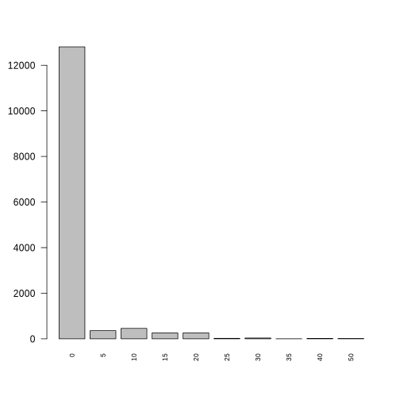
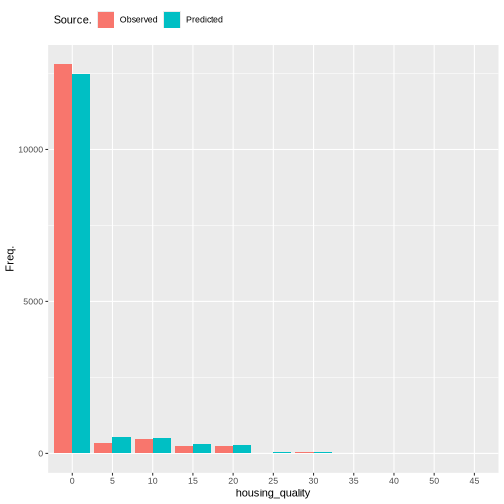

=======
Tobacco
=======

Tobacco
=======

Number of cigarettes consumed is an indicator of several mental
illnesses including anxiety (Lawrence et al. 2010).

Data
----

What variables are included? Why is this output chosen. What explanatory
variables are used and why are they chosen

.. code:: r

   discrete_barplot(obs, "ncigs")

   plot of chunk tobacco_data

Methods
-------

The number of zero inflated values is higher than expected for a count
distribution such as a poisson distribution. This inflation occurs
naturally as a large proportion (over 50%) of the population do not
smoke. There are two sources of cigarette consumption that can be
modelled using zero inflated models. In this case a zero-inflated
poisson (ZIP) is used. Two models are fitted simulatenously. One is a
logistic regression that estimates whether a person smokes cigarettes or
not. This provides a simple probability of smoking or not. The second is
a poisson counts model estimating the number of cigarettes consumed.

.. _data-1:

Data
----

Two set of variables are needed for the logistic and poisson parts of
the ZIP model respectively.

Variables that predict how much a person smokes.

age. persons age. generally older people and very young smoke. SF_12.
wellbeing estimates number of cigarettes smoked. labour_state. whether a
person is employed or not. ethnicity. certain ethnicities more likely to
smoke cigarettes. education_state. highest qualification. job_sec job
quality hh_income household income ncigs previous number consumed.

Variables that predict whether a person smokes

ethnicity. certain ethnicities more likely to smoke cigarettes.
labour_state. whether a person is employed or not. age SF_12. wellbeing
estimates number of cigarettes smoked. ncigs previous number consumed.

Results
-------

Almost all coefficients significant. Particularly prevous consumption of
cigarettes. Good estimation of the number of non-smokers in the
population at around 55%. Counts of smoking are underdispersed and fail
to estimate consumption over 20 cigarettes.

   plot of chunk tobacco_output

::

   ##                           Length Class         Mode     
   ## predictions               591620 -none-        numeric  
   ## num.trees                      1 -none-        numeric  
   ## num.independent.variables      1 -none-        numeric  
   ## mtry                           1 -none-        numeric  
   ## min.node.size                  1 -none-        numeric  
   ## prediction.error               1 -none-        numeric  
   ## forest                        10 ranger.forest list     
   ## splitrule                      1 -none-        character
   ## treetype                       1 -none-        character
   ## call                           6 -none-        call     
   ## importance.mode                1 -none-        character
   ## num.samples                    1 -none-        numeric  
   ## replace                        1 -none-        logical  
   ## dependent.variable.name        1 -none-        character

References
----------

.. container:: references csl-bib-body hanging-indent
   :name: refs

   .. container:: csl-entry
      :name: ref-lawrence2010anxiety

      Lawrence, David, Julie Considine, Francis Mitrou, and Stephen R
      Zubrick. 2010. “Anxiety Disorders and Cigarette Smoking: Results
      from the Australian Survey of Mental Health and Wellbeing.”
      *Australian & New Zealand Journal of Psychiatry* 44 (6): 520–27.
