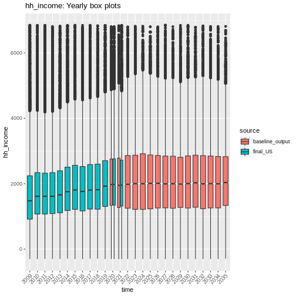
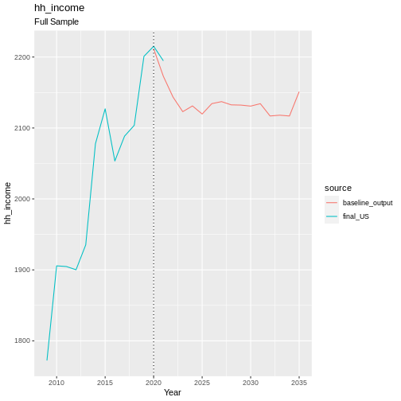
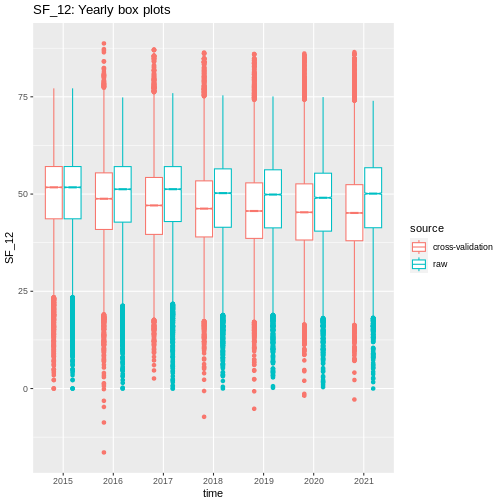
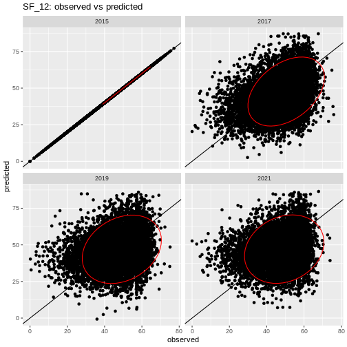
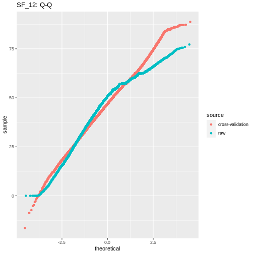
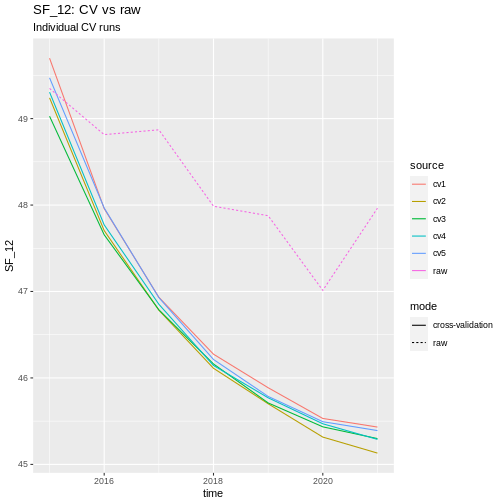
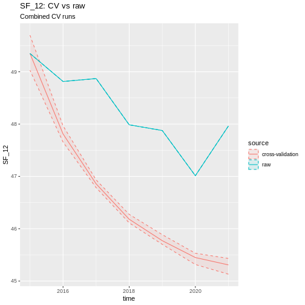

Validation
==========

For validation MINOS uses 2 methods; ‘handover’ plots and 5-fold
cross-validation.

Handovers
---------

Handovers are not a method of statistical validation, but more of a
sanity check giving a quick visual indication that the transition models
are behaving as we would expect. In these plots, we show the ‘handover’
from the unsimulated survey data to the simulated model output. This
shows us whether the trends seen in the survey data are carried on into
the simulation, and therefore whether the simulation continues trends
from the underlying data.

As an example, see below the handover plots for household income.

.. code:: r

   ### Read data in for handovers plots
   # Read raw datafiles in
   raw.files <- list.files(here::here('data', 'final_US'), pattern='[0-9]{4}_US_cohort.csv', full.names = TRUE)
   raw.dat <- do.call(rbind, lapply(raw.files, read.csv))
   raw.dat <- raw.dat %>%
     filter(weight > 0)

   out.path <- here::here('output', 'default_config/')
   base.dat <- read_singular_local_out(out.path, 'baseline', 
                                       drop.dead = TRUE, 
                                       drop.zero.weight = TRUE)

   # cut off any years of raw data AFTER start year of simulation
   if (min(base.dat$time) <= max(raw.dat$time)) {
     raw.dat <- raw.dat %>%
       filter(time <= min(base.dat$time))
   }

   # cut missing data for key variable
   raw.dat <- raw.dat %>%
     filter(!.data[['hh_income']] %in% miss.values)

   handover_boxplots(raw.dat, base.dat, 'hh_income')

   plot of chunk hh_income_handovers

.. code:: r

   handover_lineplots(raw.dat, base.dat, 'hh_income')

   plot of chunk hh_income_handovers

Cross-Validation
----------------

The other form of validation is 5-fold cross-validation (CV), which is a
valid form of statistical validation. For CV, we split the survey data
into 5 pieces by splitting the list of personal identifiers into 5 equal
chunks (this ensures that each chunk of data will have roughly similar
numbers of individuals covering the full range of the survey).

With the data split into 5 chunks we can simulate a single each chunk of
the data independently, fitting transition models to the other 4/5ths of
data before starting. We run each chunk once, starting in 2015 and
running to 2021. This allows us to compare our simulated values to the
true raw data over this time period, and assessing how our model is
performing when trying to recreate real data.

.. code:: r

   cv.mean.plots(cv1, cv2, cv3, cv4, cv5, raw, 'SF_12')

|plot of chunk cv_hh_income_vis|\ |image1|

.. code:: r

   multi_year_boxplots(raw, cv, 'SF_12')

   plot of chunk cv_hh_income_vis

.. code:: r

   snapshot_OP_plots(raw, cv, 'SF_12', target.years = c(2015, 2017, 2019, 2021))

::

   ## Warning: Use of .data in tidyselect expressions was deprecated in tidyselect 1.2.0.
   ## ℹ Please use `all_of(var)` (or `any_of(var)`) instead of `.data[[var]]`
   ## This warning is displayed once every 8 hours.
   ## Call `lifecycle::last_lifecycle_warnings()` to see where this warning was generated.

::

   ## Warning in MASS::cov.trob(data[, vars]): Probable convergence failure

   plot of chunk cv_hh_income_vis

.. code:: r

   q_q_comparison(raw, cv, 'SF_12')

   plot of chunk cv_hh_income_vis

References
----------

